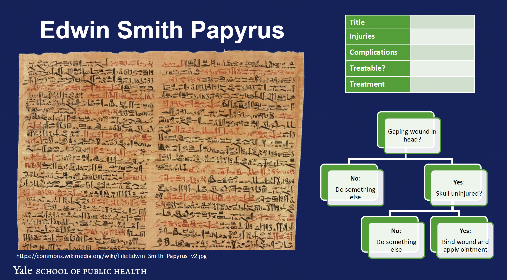
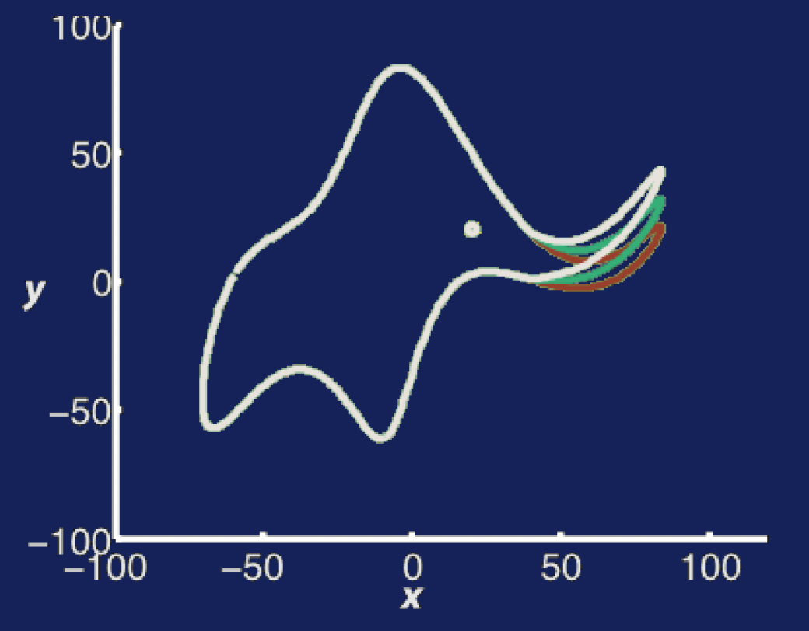

# Introduction to Informatics

## 0. Learning Objectives
- Distinguish informatics from related disciplines.
- Explain the relationship between data, information, knowledge, and models.
- Describe ontologies as a concept and their role. List health-relevant ontologies.

## 1. What is informatics?

*Informatics* is:

> The study of how to *represent, store, integrate, and communicate* information and how to *apply domain knowledge* to data to deliver new insights.

### Dewey Decimal System
- Identifiers
- Hash-functions
    - A hash function is a function that distills an input (or 'message') and returns a fixed-size string of bytes.
    - The output is called the hash value, hash code, or simply hash.
- Standards

### Edwin Smith Papyrus


### Turing Machine
- Every *computable problem* can be solved using only a few operations and infinite memory.
- Essentially all programming languages are Turing complete (except for the memory).
- In practice, computers support more capabilities, but this is mostly for convenience and performance not for expanding the set of problems that can be solved.
be solved.

### Information Theory
- Electronic and optical signals degrade over time and distance
    - i.e. all communication channels are noisy
- Claude Shannon's Noisy Channel Coding Theorem (1948) established the limits of reliable communication over noisy channels.
- Error-detecting strategies and error-correcting codes are used to combat noise (e.g., Hamming(7,4) code)

### Electronic Health Records
- Once upon a time, health data was siloed in paper charts
    1. Not easily searchable
    2. Only one doctor could access the data
    3. Portable, easy to use, no power required
- Vista is the first EHR system and still in use today
- Health Information Technology for Economic and Clinical Health (HITECH) Act of 2009

### Large Language Models
- Will this be a powerful tool for democratizing computer analytics?

## 2. Informatics Concepts
- Data/Information/Knowledge
- Structured and unstructured data and metadata
- Models
- Ontologies


> Knowledge is what we need to do things correctly; wisdom is knowing the correct things to do.

### Data + Metadata + Domain Knowledge = Information
- **Data**: Raw facts or figures
- **Metadata**: Data about data
- **Domain Knowledge**: Knowledge about the domain
- **Information**: Data + Metadata + Domain Knowledge

#### Data
- **Structured:** Organized in a predefined format (e.g., databases)
- **Unstructured:** No predefined format (e.g., text documents)
- **Semi-structured:** Somewhere in between (e.g., XML, JSON)

### Models
> A model is “an intellectual construct in artefact form that provides an abstract, highly formalized… simplified representation of a phenomenon and its interactions.” (Coffey and Atkinson 1996)

> All models are wrong, but some are useful. (George E.P. Box)

#### Avoid overfitting

> Mayer, J., Khairy, K., & Howard, J. (2010). Drawing an elephant with four complex parameters. American Journal of Physics, 78(6), 648-649.

$$
x(t) = \Sigma_{i=0}^{\infty} (A_k^x \cos(kt) + B_k^x \sin(kt)) \\
y(t) = \Sigma_{i=0}^{\infty} (A_k^y \cos(kt) + B_k^y \sin(kt))
$$

You can draw an elephant with four complex parameters. Avoid overfitting.



#### Knowledge-based systems INTERNIST-I, Mycin (1970s)

- Relied on an extensive “Knowledge-Base”, effectively rules for ranking likelihood.

```
RULEO35:
PREMISE: ($AND (SAME CNTXT GRAM GRAMNEG)
(SAME CNTXT MORPH ROD)
(SAME CNTXT AIR ANAEROBIC))
ACTION: (CONCLUDE CNTXT IDENTITY BACTERIUDES TALLY .6)
```

#### Dynamic Systems Models


$$
\begin{aligned}
\frac{dS}{dt} &= -\beta S(t)(I_{udx}(t) + \epsilon I_{dx}(t)) \\
\frac{dI_{udx}}{dt} &= \beta S(t)(I_{udx}(t) + \epsilon I_{dx}(t)) - \gamma I_{udx}(t) \\
\frac{dI_{dx}}{dt} &= \gamma I_{udx}(t) - \delta I_{dx}(t) \\
\frac{dR}{dt} &= \delta I_{dx}(t)
\end{aligned}
$$

##### Hodgkin-Huxley

$$
\begin{aligned}
C_m \frac{dV}{dt} &= I_{ion} - I_{stim} \\
I_{ion} &= g_{Na} m^3 h (V - V_{Na}) + g_K w^4 (V - V_K) + g_{leak} (V - V_{leak})
\end{aligned}
$$

#### Agent-based Models
- Simulate the behavior of individual agents (e.g., people) in a complex system.


#### Statistical Models
- Model selection depends on the nature of the data and research questions
    - K-nearest neighbors
    - Linear regression
    - Decision trees
    - Support vector machines
    - Neural networks

### Ontologies and Terminologies
- **Standardized vocabularies** for data representation
- A systematic approach to defining and organizing concepts and their relationships

#### Medical Terminology
- SNOMED CT (Systematized Nomenclature of Medicine - Clinical Terms)
- ICD-10 (International Classification of Diseases, Tenth Revision)
- LOINC (Logical Observation Identifiers Names and Codes)
- RxNorm (RxNorm is a standardized medication database)
- MeSH (Medical Subject Headings)