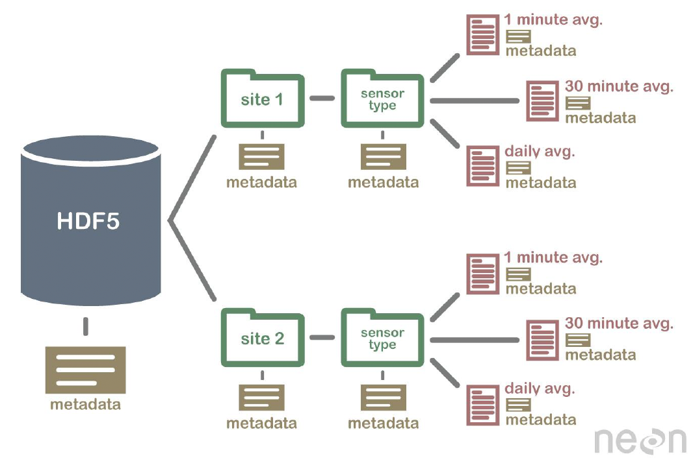

# Standards in Healthcare and Computing

## 0. Learning Objectives
- Explain why we need data standards.
- Identify examples of hierarchical data formats and relate them to common data structures.
- Discuss which data standards are most appropriate for which data.
Give examples of informatics-specific data standards and state their domains.

## 1. Definition of Standards

- **Government Context**: Requirements, compliance measures, or minimum qualification criteria
- **Digital Technology Context**: Common technical specifications for information processing and transmission

- **Purpose of Standards**:
  - Ensure compatibility and interoperability between different systems and technologies.
  - Facilitate information sharing and communication.

## 2. Categories of Standards

### A. Data Protection Standards
- **HIPAA (Health Insurance Portability and Accountability Act)**: Protects patient health information in the United States.
- **FERPA (Family Educational Rights and Privacy Act)**: Protects student education records.
- **GDPR (General Data Protection Regulation)**: A regulation in EU law on data protection and privacy.

### B. Accessibility Standards
- **WCAG (Web Content Accessibility Guidelines)**: Provides guidelines for making web content more accessible to people with disabilities.

### C. Low-Level Standards
- **ASCII (American Standard Code for Information Interchange)**: A character encoding standard for electronic communication, defining 128 characters for use in computers and telecommunications.
  - Why 7-bit?
    - 7 bits are enough to represent 128 different characters, including all uppercase and lowercase letters, digits, punctuation marks, and control characters.
    - This allows for a compact and efficient text representation in digital systems.
  - **Unicode**: A standard for character encoding that covers almost all the characters and scripts used in the world, facilitating text processing in different languages.
  - **IEEE 754**: A technical standard for floating-point arithmetic used in computers, ensuring consistent and reliable representation of decimal numbers.

### D. Networking Standards
- **TCP/IP (Transmission Control Protocol/Internet Protocol)**: The fundamental communication protocols for the internet.
- **HTTPS (Hypertext Transfer Protocol Secure)**: An extension of HTTP for secure communication over a computer network.
- **HL7v2 (Health Level Seven Version 2)**: A set of international standards for the transfer of clinical and administrative data between healthcare systems.
- **FHIR (Fast Healthcare Interoperability Resources)**: A standard for exchanging healthcare information electronically, combining the best aspects of HL7v2 and HL7v3.

### E. Semantic Standards
- **Ontologies**: Structured frameworks for organizing information that define the relationships between concepts in a domain.

### F. Data File Standards
- **CSV (Comma-Separated Values)**: A simple file format used to store tabular data, such as a spreadsheet or database.
- **JSON (JavaScript Object Notation)**: A lightweight data interchange format that is easy for humans to read and write and easy for machines to parse and generate.
- **XML (eXtensible Markup Language)**: A markup language that defines a set of rules for encoding documents in a format that is both human-readable and machine-readable.
- **GeoJSON**: A format for encoding a variety of geographic data structures.
- **FASTQ**: A text-based format for storing nucleotide sequences, often with a corresponding quality score.
  
## 3. Interoperability in Standards

### A. Importance of Interoperability
- Allows different systems and organizations to work together (inter-operate), enhancing data sharing, communication, and collaboration.

### B. Historical Milestones
- **1945**: ENIAC completed, laying the foundation for digital computing.
- **1960**: COBOL achieves portability, enabling the same code to run on different machines.
- **1985**: IEEE 754 standardizes floating-point arithmetic, ensuring consistent computations across systems.

## 4. Establishing a Standard

### A. Processes for Standardization
- **Government Mandates**: Governments may enforce standards through regulations and laws to ensure safety, security, and compatibility.
- **Payor Mandates**: Insurance companies and other payors may require specific standards to ensure consistency and reliability in data exchanges.
- **Standards Organizations**: Bodies like ISO, IEEE, and HL7 develop and maintain standards based on consensus among experts.
- **Market Forces**: Consumer demand and competitive pressures can drive the adoption of standards.
- **Advocacy**: Advocacy groups may push for standards to ensure accessibility, security, or other priorities.

## 5. Generic File Types and Their Usage

- **CSV (Comma-Separated Values)**:
  - Used for simple, tabular data storage.
  - Example in Python:

    ```python
    import pandas as pd
    data = pd.read_csv("file.csv")  # Reading CSV
    data.to_csv("output.csv")       # Writing CSV
    ```
  
  - Example of a CSV file:
    ```
    name,age,city
    Alice,30,New York
    Bob,25,Los Angeles
    ```
  
- **JSON (JavaScript Object Notation)**:
  - Lightweight format for storing and transporting data, often used in web applications.
  - Example in Python:

    ```python
    import json
    with open('data.json', 'r') as f:
        data = json.load(f)  # Reading JSON

    with open('output.json', 'w') as f:
        json.dump(data, f, indent=4)  # Writing JSON with indentation
    ```
  
  - Example of a JSON file:
    ```json
    {
      "name": "Alice",
      "age": 30,
      "city": "New York"
    }
    ```
  
- **HDF5 (Hierarchical Data Format version 5)**:
  - Designed to store large amounts of data. Often used in scientific computing.
  - Example in Python:

    ```python
    import h5py
    with h5py.File('data.hdf5', 'r') as f:
        dataset = f['dataset_name']  # Reading HDF5 data
    ```



  - Example of a HDF5 file:
    ```
    # HDF5 file metadata
    ```

- **XML (eXtensible Markup Language)**:
  - Structured markup language used for a wide variety of applications, including web services and configuration files.
  - Example in Python:
    ```python
    import xml.etree.ElementTree as ET
    tree = ET.parse('file.xml')  # Reading XML
    root = tree.getroot()
    ```
  
  - Example of an XML file:
    ```xml
    <root>
      <element attribute="value">value</element>
    </root>
    ```
  
## 6. Specialized Data Standards

- **GeoJSON**: A format for encoding a variety of geographic data structures using JavaScript Object Notation (JSON).
  - Example of a GeoJSON file:
    ```json
    {
      "type": "FeatureCollection",
      "features": [{"type": "Feature", "geometry": {"type": "Point", "coordinates": [102.0, 0.5]}, "properties": {"name": "Dinagat Islands"}}]
    }
    ```

- **SBML (Systems Biology Markup Language)**: An XML-based format for representing computational models in biology.
  - Example of an SBML file:
    ```xml
    <sbml level="2" version="1">
      ...
    </sbml>
    ```

- **RDF (Resource Description Framework)**: A framework for representing information about resources in the web, often used in knowledge graphs.
  - Example of an RDF file:
    ```xml
    <?xml version="1.0" encoding="utf-8"?>
    <rdf:RDF xmlns:contact="http://www.w3.org/2000/10/swap/pim/contact#"
             xmlns:rdf="http://www.w3.org/1999/02/22-rdf-syntax-ns#">
      <rdf:Description rdf:about="http://www.w3.org/People/EM/contact#me">
        <contact:fullName>Eric Miller</contact:fullName>
        <contact:mailbox rdf:resource="mailto:e.miller123(at)example"/>
        <contact:personalTitle>Dr.</contact:personalTitle>
        <rdf:type rdf:resource="http://www.w3.org/2000/10/swap/pim/contact#Person"/>
      </rdf:Description>
    </rdf:RDF>
    ```


- **FASTA**: A format for storing nucleotide sequences, often used in bioinformatics. (Use `Bio.SeqIO` to read and write FASTA files.)
  - Example of a FASTA file:
    ```
    >seq1
    ATCGATCGATCG
    >seq2
    ATCGATCGATCG
    ```

- **FASTQ**: A format for storing nucleotide sequences with quality scores, often used in high-throughput sequencing. (Use `Bio.SeqIO` to read and write FASTQ files.)
  - Example of a FASTQ file:
    ```
    @seq1
    ATCGATCGATCG
    +
    #######
    ```

## 7. Healthcare Data Standards

- **HL7v2**: The most widely used messaging standard in healthcare for exchanging clinical data.
- **HL7v3**: XML-based, designed to provide more flexibility and structure than HL7v2.
- **FHIR (Fast Healthcare Interoperability Resources)**: A newer standard that integrates best practices from HL7v2 and HL7v3, focusing on ease of implementation and interoperability.

## 8. **Discussion Points**

- **Challenges in Implementing Standards**:
  - Fragmentation of standards can lead to interoperability issues.
  - Different organizations may have varying requirements and capabilities.

- **Impact of International Standards**:
  - Global adoption of standards can enhance cross-border healthcare collaborations and data exchanges.

- **Staying Updated**:
  - Healthcare professionals must continuously educate themselves on evolving standards to ensure compliance and leverage new technologies effectively.