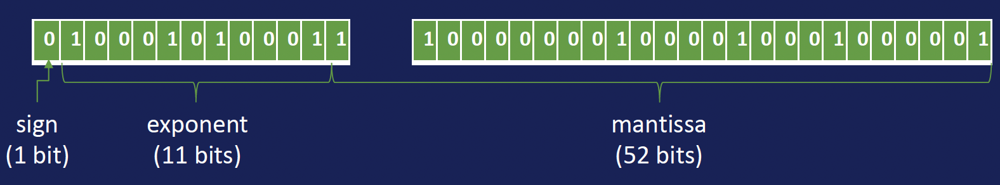
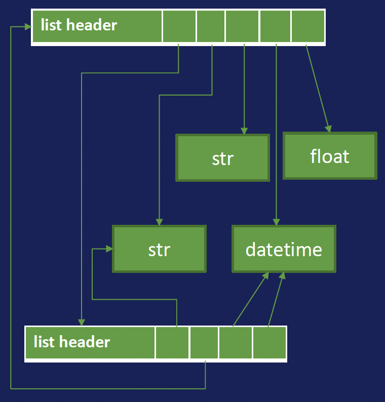
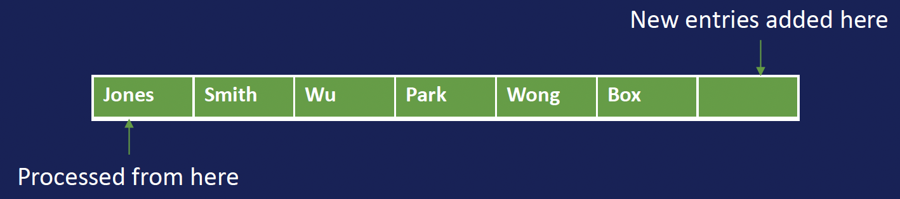
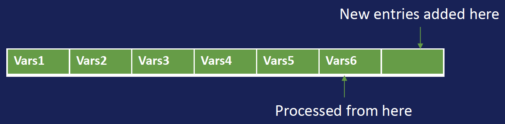
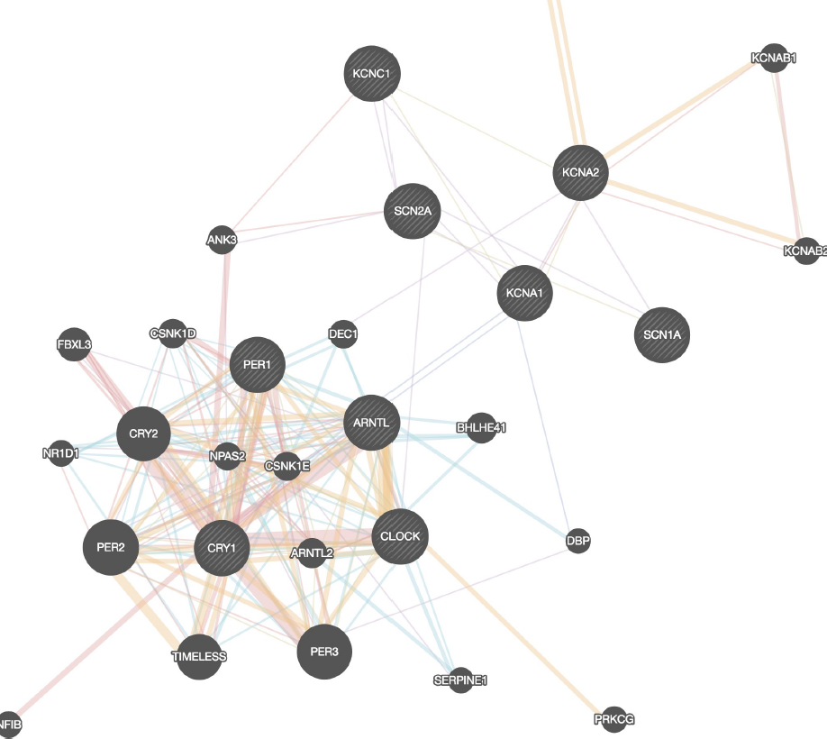

# Data Structures and Algorithms

## 0. Learning Objectives
- Explain how computer math differs from regular math and why this will affect certain calculations.
- Compare and contrast common data structures (speed of access, approximate memory usage, etc); recognize and implement them; identify common uses for data structures like trees and stacks.
- Choose appropriate data representation for answering questions of interest.
- Explain the relationship between computational complexity and runtime.
- Compute and numerically estimate computational complexity of an algorithm.
- Identify factors besides computational complexity that affect the runtime performance of an algorithm.
- Interpret log-log graphs showing performance.

## 1. Basic Data Concepts

### Data Types
- **Conceptual Types**:
  - Numbers
  - Text
  - Time series
  - Images

### Data Organization
- **Structures**:
  - Flat
  - Hierarchical tree
  - Web/graph
- **Access Order**:
  - Arbitrary
  - Sequential
  - Sequential by importance

### Key Considerations
- Memory usage
- Time efficiency
- Disk storage
- Network performance

## 2. Python Data Types

### `PyObject`: metadata before data
The `PyObject` structure is the core data type in Python.
```c
typedef struct _object {
    Py_ssize_t ob_refcnt;
    struct _typeobject *ob_type;
} PyObject;
```

#### `sys.getsizeof()`
We can use `sys.getsizeof()` to get the size of an object in bytes.

```python
>>> import sys
>>> sys.getsizeof(None)
16
>>> sys.getsizeof(0)
24
>>> sys.getsizeof("doxycycline")
60
```

### Primitive Types
1. **Integer (int)**

   - Variable size based on value
   - Uses IEEE 754 standard
   - Memory usage increases with number size:
     - For $n \in \mathbb{N}$, if $2^{30(n-1)} \leq x < 2^{30n}$, 
     then Python will use $24 + 4n$ bytes to store the integer.

*Example calculation*:

```python
import sys

def calculate_int_size(x):
    n = x.bit_length()
    return 24 + 4 * ((n - 1) // 30 + 1)

# Example usage
x = 1073741824  # 2^30
calculated_size = calculate_int_size(x)
actual_size = sys.getsizeof(x)

print(f"For integer {x}:")
print(f"Calculated size: {calculated_size} bytes")
print(f"Actual size: {actual_size} bytes")
```

2. **Float**

   - 24 bytes fixed size
   - Uses IEEE 754 double precision
   - Non-uniform distribution of values
   
   - Note: Floating point math isn't exact
     ```python
     >>> 1e-20 > 0
     True
     >>> 1 + 1e-20 > 1
     False
     >>> 1 + 1e-20 == 1
     True
     ```

3. **String (str)**
   - *Immutable* in Python
   - Uses Unicode standard (UTF-8)
   - Variable memory usage based on encoding:
     - Latin-1: 49 + 1 byte/character
     - Most other languages: 74 + 2 bytes/character
     - Emoji: 80 + 4 bytes/character

### Container Types
1. **List**
   - Random access collection
   - 56 bytes + 8 bytes/item
   
   - Mutable structure
     - Adjusts only memory pointers, not items
     - `sys.getsizeof()` reports list structure size, not item storage
   - Linear search time O(n)

2. **Arrays**
   - Contiguous memory
   - Fixed data type
   - Types:
     - `array.array`: 64 bytes + 8 bytes per value
     - `numpy.array`: 96 bytes + 8 bytes per value
     - `bitarray`: 96 bytes + 1 byte per 8 bits
   - Fast read/write access, slow add/remove

3. **Set**
   - Unordered collection
   - No duplicates
   - Constant-time lookups
   - Hash-based implementation

  > **Hash Function**:
  > A hash function maps data to a number within a known range, ensuring:
  > - Equivalent data produces the same hash
  > - Different data may share a hash
  > - Ideally, similar data yields distinct hashes

4. **Dictionary (dict)**
   - Key-value pairs
   - Hash-based lookup (on keys only)
   - Constant-time access
   - Good for hierarchical data

5. **Classes and Objects**
   - User-defined types
   - Custom methods
   - Attributes

```python
class Patient:
    def __init__(self, name, age):
        self._name = name
        self.age = age
    @property
    def age(self):
        return self._age
    @age.setter
    def age(self, value):
        if value < 0:
            raise ValueError('age must be >= 0’)
        self._age = value

    def say_hi(self):
        print(f'Hi, my name is {self._name}.')

# this works
p = Patient('John', 40)
p.say_hi()
# this raises a ValueError
p.age = -40
```

## 3. Advanced Data Structures

### Queue
- First-in, First-out (FIFO)
- Use cases:
  - Parallel parameter sweeps
  - Request handling
  - Breadth-first search



### Stack
- Last-in, First-out (LIFO)
- Applications:
  - Recursion
  - Depth-first search



### Priority Queue
- Elements with priority
- Applications:
  - Scheduling
  - Event-driven simulation

*Example*:
```python
from heapq import heappop, heappush
patients = []
heappush(patients, (5, 'Smith'))
heappush(patients, (3, 'Jones'))
heappush(patients, (9, 'Box'))
heappush(patients, (1, 'Wu'))
heappush(patients, (7, 'Wong'))
while patients:
    print(heappop(patients))
```

*Output*:
```
(1, 'Wu')
(3, 'Jones')
(5, 'Smith')
(7, 'Wong')
(9, 'Box')
```

### Trees
1. **Basic Tree Properties**
   - Root node (no parent)
   - Parent-child relationships
   - No cycles

2. **Binary Trees**
   - 0-2 children per node
   - Applications:
     - Decision trees
     - Priority queues
     - Parsing XML/HTML

3. **Binary Search Tree**
   - Ordered structure
   - O(log n) search time when balanced
   - Used for sorting and efficient lookups

4. **Example Usage**
   - Phylogenetic trees
   - Decision trees
   - $k$-nearest neighbors
   - Implementing a priority queue
   - Parsing XML and HTML

### Graphs

- Collection of *vertices* and *edges*
  - *Vertices*: nodes that contain data
  - *Edges*: relationships between nodes



- **Applications**:
  - Protein interaction networks
  - Social networks
  - Brain connectivity
  - Language processing

- **Graph Questions**:
  - Shortest path (e.g. Dijkstra's algorithm)
  - Avg/Max distance between vertices
  - “Important” vertices or edges
    - e.g. betweenness, PageRank, node influence metrics
  - Cycles?
  - Connected components?

```python
class Graph:
    def __init__(self):
        self._vertices = []
        self._edges = []
    def add_vertex(self, v):
        self._vertices.append(v)
    def add_edge(self, v1, v2, data=None):
        if v1 in self._vertices and v2 in self._vertices:
            self._edges.append((v1, v2, data))
    def neighbors(self, v):
        result = []
        for v1, v2, data in self._edges:
            if v1 == v:
                result.append(v2)
            elif v2 == v:
                result.append(v1)
        return result
```

## 4. Complexity Analysis

### Big O Notation

#### Definition

For a given $f(x)$, we say $f(x) = O(g(x))$ if and only if there exist constants $x_0$ and $M$ such that:

$$ \vert f(x) \vert \leq M g(x) \text{ for all } x \geq x_0 $$

#### Interpretation
- Measures upper bound of growth rate
- Common complexities (from fastest to slowest):
  - O(1): Constant time
  - O($\log n$): Logarithmic
  - O($n$): Linear
  - O($n \log n$): Log-linear
  - O($n^2$): Quadratic
  - O($2^n$): Exponential
- *Warning*: Big O notation is a *bound*, not a *value*. We can also say $f(x) \in O(g(x))$.

#### Example
$$ 3x^2 + 200x + 7 = O(x^2) $$
>*Proof*:
> For $x \geq 201$,
> $$ x^2 = x \cdot x \geq 201x = 200x + x \geq 200x + 201 > 200x + 7 $$
> Therefore for $x \geq 201$,
> $$ 4x^2 = 3x^2 + x^2 > 3x^2 + 200x + 7 = \vert 3x^2 + 200x + 7 \vert $$
>That is, $\vert 3x^2 + 200x + 7 \vert < Mx^2$ for all $x \geq x_0$ where $M = 4$ and $x_0 = 201$.

#### Theorem
If 
$$ f(x) = a_mx^m + a_{m-1}x^{m-1} + \cdots + a_1x + a_0  $$
and $a_m > 0$,
then
$$ f(x) = O(x^m) $$
That is, a polynomial of degree $m$ is $O(x^m)$.

### Little $o$ Notation
#### Definition
For a given $f(x)$, we say
$$ f(x) = o(g(x)) $$
if and only if for every $\epsilon > 0$, there exists $N$ such that
$$ f(x) \leq \epsilon g(x) $$
for all $x \geq N$.

### Big $\Omega$ Notation
#### Definition
For a given $f(x)$, we say
$$ f(x) = \Theta(g(x)) $$
if and only if there exists $x_0$, $M_1$, and $M_2$ such that
$$ M_1 g(x) \leq f(x) \leq M_2 g(x) $$
for all $x \geq x_0$.

### Practical Considerations
We use `time.perf_counter()` to measure execution time.
- Memory usage vs. time tradeoffs
- Implementation overhead
- Data size impact
- System constraints

### Common Operation Complexities
- List/Dictionary index lookup: O(1)
- List search: O($n$)
- Set membership test: O(1)
- Sorting algorithms:
  - Bubble Sort: O($n^2$)
  - Merge Sort: O($n \log n$)
