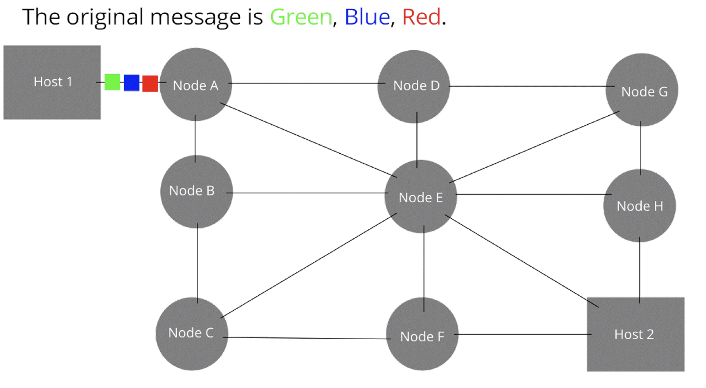

# The Internet and APIs
## 0. Learning Objectives
- Describe the process and standard protocols involved when information is requested and received over the internet.
- List the main types of HTTP requests and their roles.
- Use Python to request information from a server.
- Explain what an API is and contrast RESTful APIs and RPCs.
- Explain the concept of semantic (or clean) URLs and how they relate to RESTful vs RPC.
- Understand the role of terms of use on API systems.
- Implement and use APIs.

## 1. Historical Context
- 1969: First computer-to-computer message sent (UCLA to Stanford)
- ARPANET Evolution: 1967-1990
- Key developments: TCP/IP (1983), DNS (1984)

## 2. Network Fundamentals
- IPv4 (32-bit) vs IPv6 (128-bit) addressing
    - IPv4 Example: 192.168.1.1
    - IPv6 Example: 2001:0db8:85a3:0000:0000:8a2e:0370:7334
- DNS (Domain Name System)
  - Record types: A/AAAA, CNAME, MX, TXT

- Switching methods: Circuit vs Packet switching
    - Circuit switching: dedicated connection for each call, between two points
    - Packet switching: shared resources, packets routed dynamically, among many points


## 3. Web Communication
### A. HTTP Protocol
- Common ports: FTP (20,21), SSH (22), SMTP (25), DNS (53), HTTP (80), HTTPS (443)
- Methods:
  - GET: Retrieve data
  - POST: Submit data
  - PUT: Update entire resource
  - DELETE: Remove resource
  - Others: HEAD, CONNECT, OPTIONS, TRACE, PATCH

### B. HTTP Details
- Response Codes:
  - 1xx: Informational
  - 2xx: Success (200 OK)
  - 3xx: Redirection
  - 4xx: Client Error (404 Not Found)
  - 5xx: Server Error
- Session Management via Cookies
- Parameters: GET (URL) vs POST (body)

## HTML & DOM
- HTML: Structure markup language
- DOM (Document Object Model): A consistent representation of the document
  - Tree structure
  - Programmatic interface for document manipulation
  - Key methods: getElementsByTagName, getAttribute, getChildren

## APIs (Application Programming Interfaces)
### Types
1. RPC (Remote Procedure Call)
   - Flexible function calls
   - Arbitrary semantics
   - Example: /getDisease?id=74

2. REST (Representational State Transfer)
   - Client-server architecture
   - Stateless
   - Uniform interface
   - Resource-oriented
   - Uses standard HTTP methods
   - Clean URLs (semantic URLs)

### Implementation Considerations
- Data Formats: JSON, XML
- Terms of Service:
  - Rate limits
  - Usage restrictions
  - Authorization requirements
- Error handling
- Response parsing

## Example Implementation
```python
import requests
import xml.dom.minidom as m

def get_info(pmid):
    r = requests.get(
        "https://eutils.ncbi.nlm.nih.gov/entrez/eutils/"
        f"efetch.fcgi?db=pubmed&retmode=xml&id={pmid}"
    )
    doc = m.parseString(r.text)
    titles = doc.getElementsByTagName("Title")
    abstracts = doc.getElementsByTagName("AbstractText")
    return (titles[0].childNodes[0].wholeText, 
            abstracts[0].childNodes[0].wholeText)
```