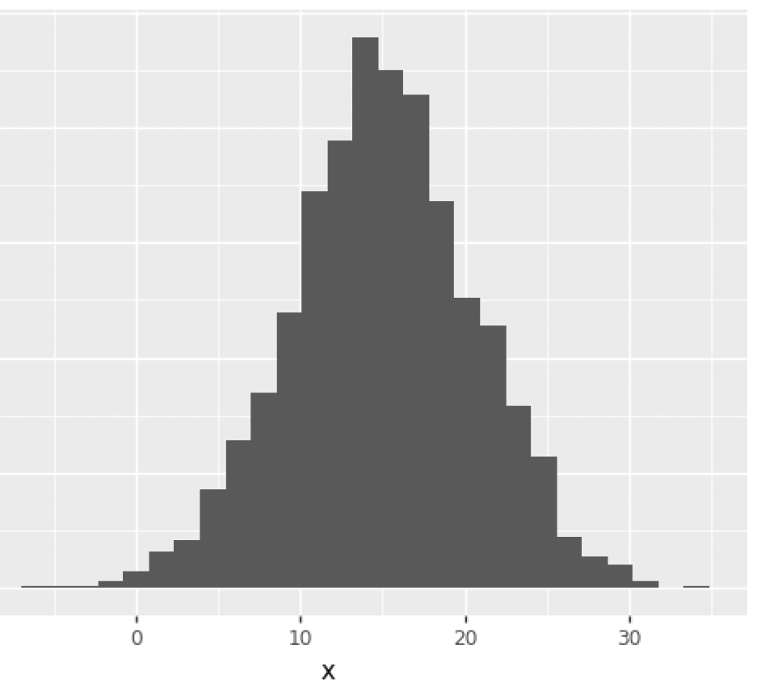
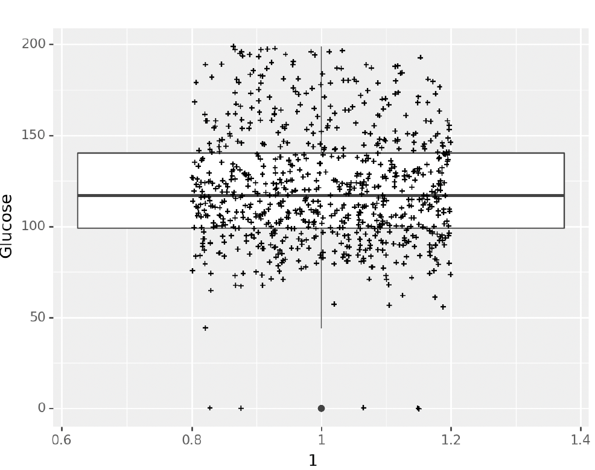
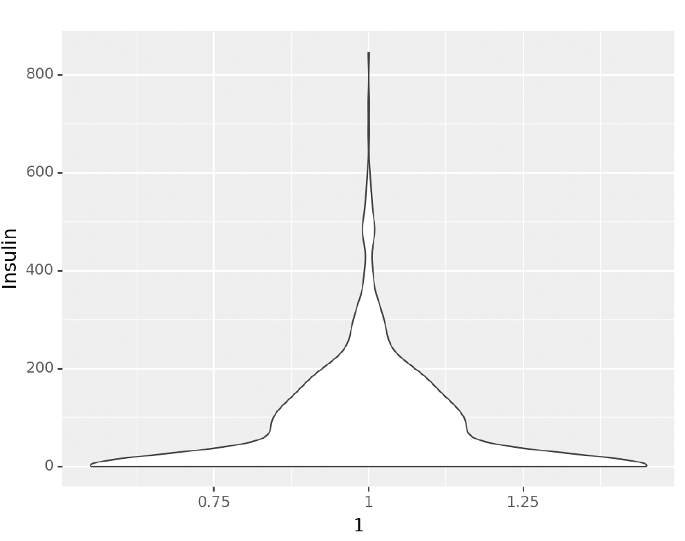
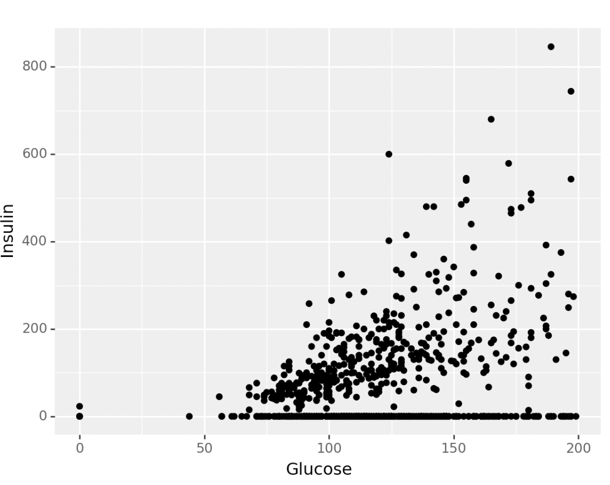
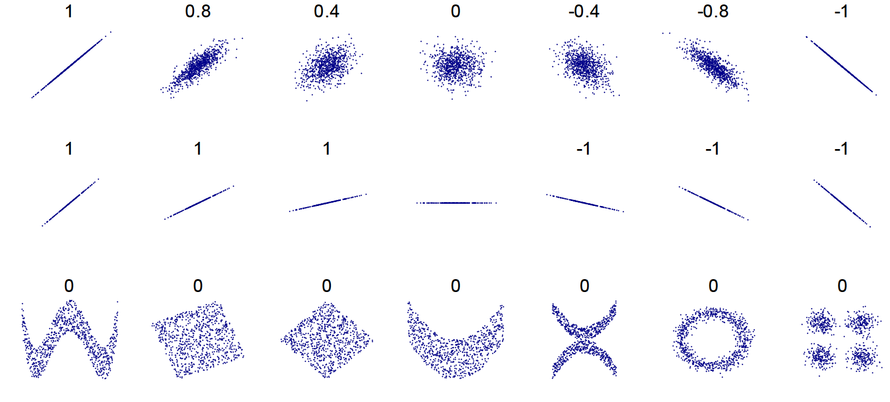

# Data Exploration and Cleaning
## 0. Learning Objectives
- Understand the importance of exploring data and its structure before using it.
- Explain the significance of understanding variable distribution and describe ways to visualize the distribution.
- Look for outliers, correlated variables, and the overall distribution of data; describe why these factors are important.
- Understand the differences between common dimensionality reduction strategies. Explain why we would use them.
- Explain the concepts of data cleaning and imputation.
- Explain the implications of using various imputation strategies.
- Give examples of why health data may need cleaning.
- Describe strategies for working with missing data, and identify the three main types of missing data.


## 1. Data Exploration

### Initial Data Understanding
- Examine data appropriateness before starting research
- Consider three dimensions of variables:
  - Role (Predictor vs Target)
  - Data type (Strings, Dates, Numbers)
  - Nature (Categorical vs Continuous)

### Data Structure Assessment
- Check data point quantity
- Verify variable data types
- Validate value ranges
- Assess data completeness
- Use pandas for type conversion when needed

### Univariate Analysis
1. **Categorical Variables**
   - Use `value_counts()`
   - Visualize with bar plots
   

2. **Continuous Variables**
   - Basic statistics (`mean`, `median`, `mode`, `std`, `min`, `max`)
   - Visualizations:
     - Histograms
     
     - Box plots (shows median, quartiles, outliers)
     
     - Violin plots (distribution shape)
     
     - Q-Q plots (normality test)
     

3. **Data Standardization**
   - Z-score standardization: $z_i = \frac{x_i - \bar{x}}{s}$ (mean 0, std 1)
   - Min-max scaling (0 to 1)

### Bivariate/Multivariate Analysis
- Scatter plots

- Correlation analysis (Pearson)

- Watch for outliers

### Dimensionality Reduction
1. **Linear Methods**
   - PCA (Principal Component Analysis): Unsupervised, linear
     - Idea: find directions of maximum variance in high-dimensional data and project data onto these directions
   
   - LDA (Linear Discriminant Analysis): Supervised, linear
     - Idea: find directions that maximize class separability
   

2. **Non-linear Methods**
   - t-SNE: Unsupervised, non-linear
     - Idea: map high-dimensional data to a 2D space for visualization
     
   - UMAP: Unsupervised, non-linear
     - Idea: similar to t-SNE, but faster and more scalable

## 2. Data Cleaning

### Common Data Issues
1. **Non-standardized Data**
   - Inconsistent formats
   - Different terminologies
   - Use standard ontologies (MeSH, RxNorm, UMLS, etc.)

2. **Structure Issues**
   - Apply tidy data principles:
     - One variable per column
     - One observation per row
     - One value per cell
   - Use melting for restructuring

   *Example:*

   ```python
   df = pd.DataFrame({
       'id': [1, 1, 1],
       'name': ['Alice', 'Alice', 'Alice'],
       'math': [90, 85, 95],
       'science': [85, 90, 88],
       'english': [95, 92, 93]
   })
   # id name math science english
   # 1 Alice 90 85 95
   # 1 Alice 85 90 92
   # 1 Alice 95 88 93
   df.melt(id_vars=['id', 'name'], value_vars=['math', 'science', 'english'])
   ```

   *Output:*

   ```
   id name  variable value
   1  Alice math      90
   1  Alice science   85
   1  Alice english   95
   ```

3. **Duplicate Data**
   - Check for exact duplicates
   - Verify legitimate duplicates
   - Use `drop_duplicates()` with appropriate criteria

4. **Incorrect Values**
   - Define valid ranges
   - Check categorical values
   - Look for inconsistencies
   - Examine outliers

### Missing Data

#### Types of Missing Data
1. **MCAR (Missing Completely At Random)**: Reason for missing data is unrelated to any other variables in the dataset.
2. **MAR (Missing At Random)**: Reason for missing data is related to other variables in the dataset.
3. **MNAR (Missing Not At Random)**: Reason for missing data is related to the missing value itself.

#### Handling Missing Data
1. **Detection**
   - Use `isnull()`/`notnull()`
   - Apply Little's Test for MCAR
   - Check for MAR patterns

2. **Solutions**
   - Drop rows (listwise/pairwise deletion)
   - Drop fields (columns)
   - Imputation methods:
     - Deductive imputation
     - Multiple imputation
     - FIML (Full Information Maximum Likelihood)
     - EM (Expectation Maximization)

3. **Avoid**
   - Simple mean/median replacement
   - Single deterministic regression
   - Single stochastic regression