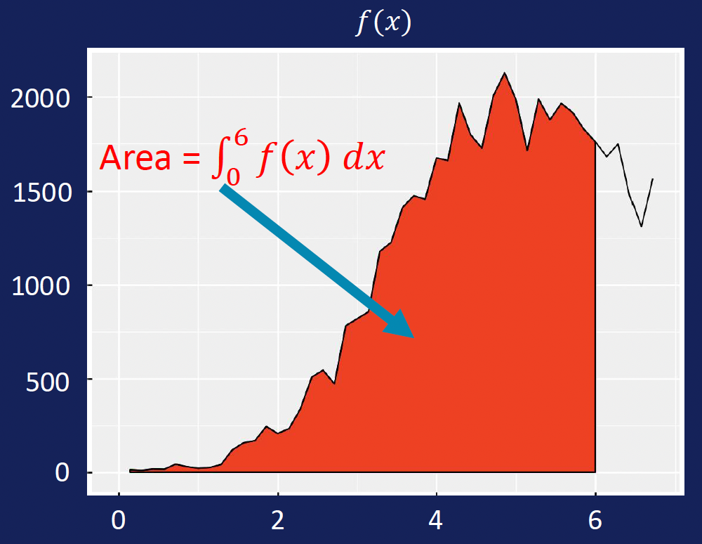
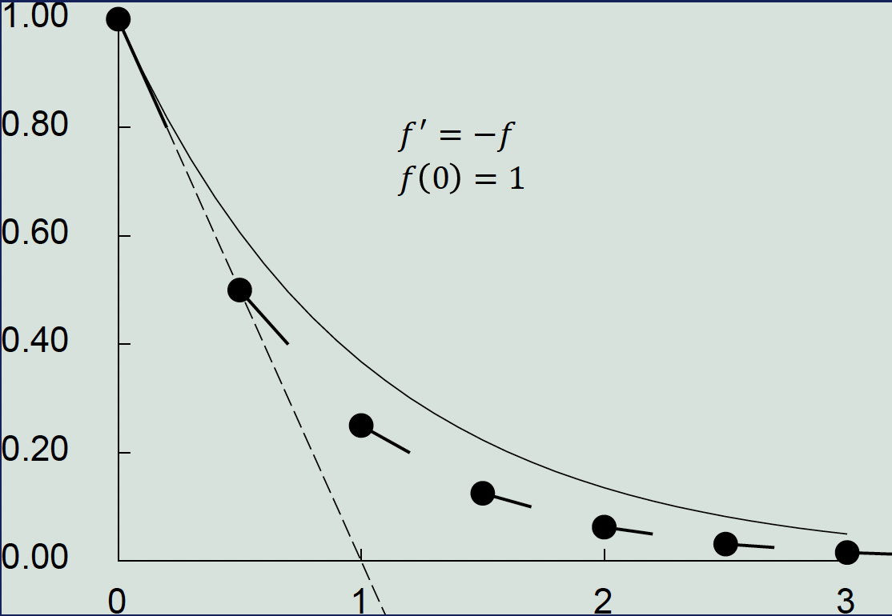
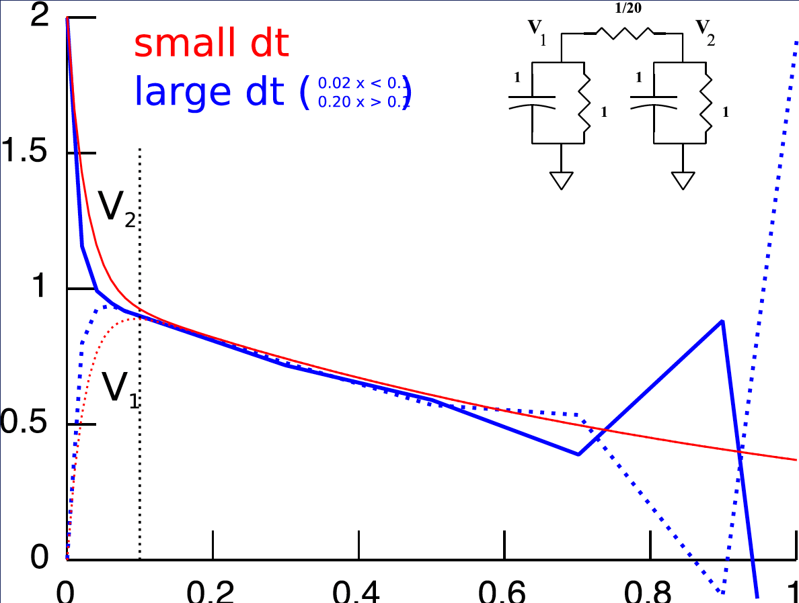
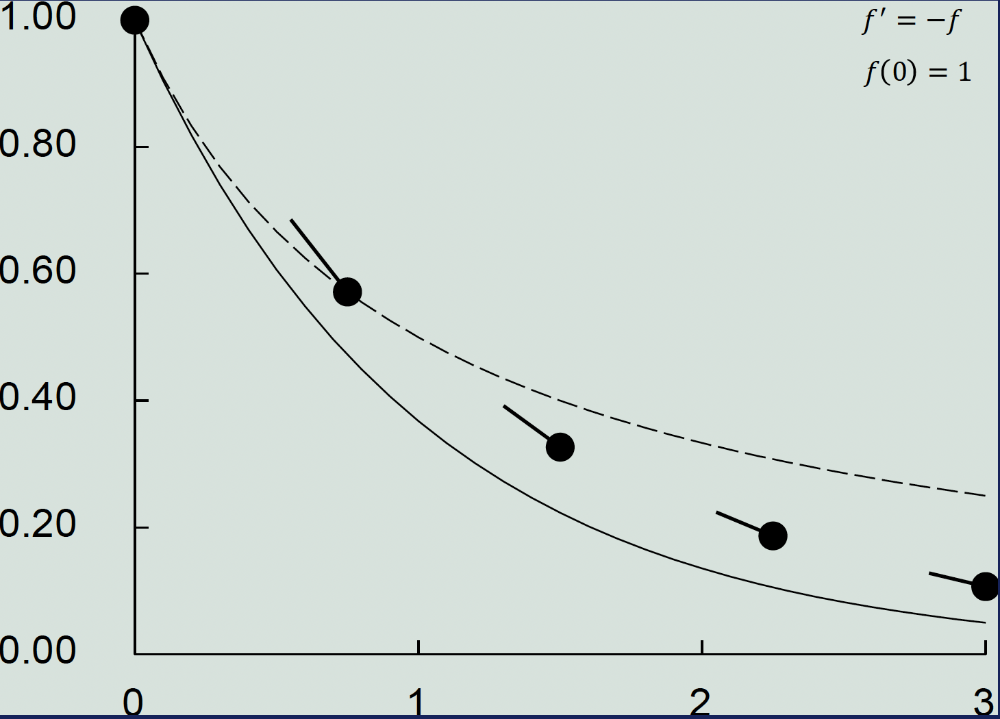
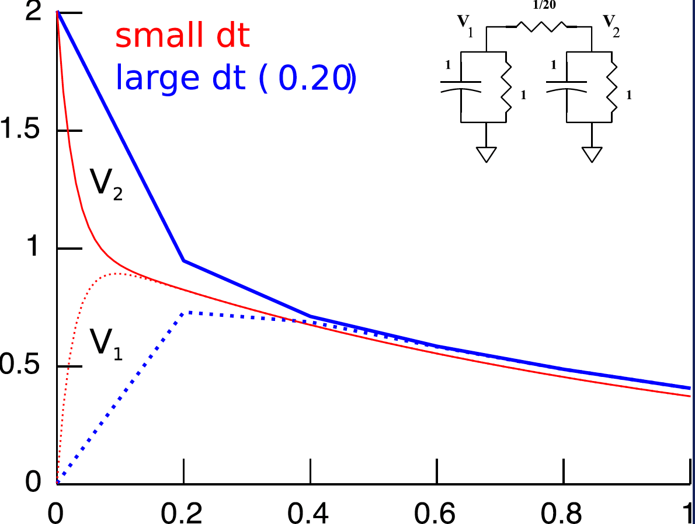
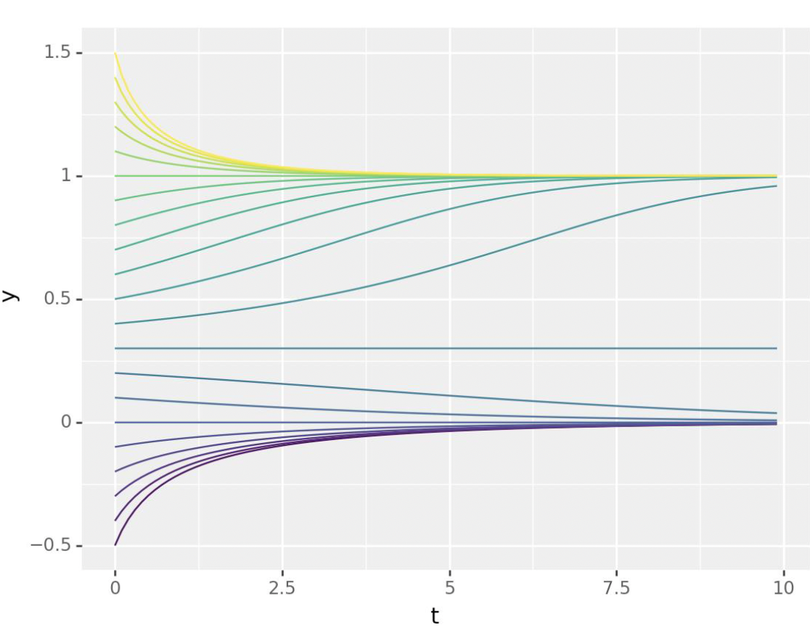
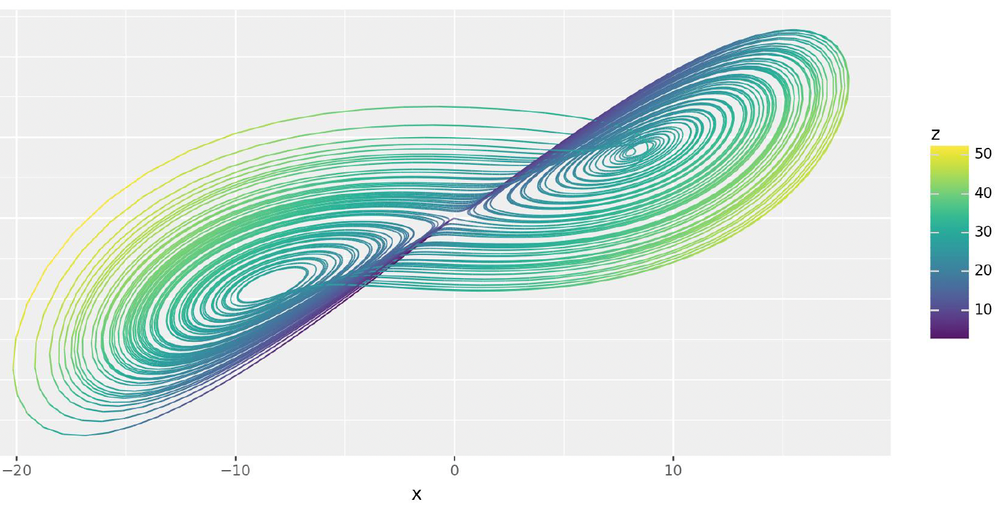

# Numerical Calculus
## 0. Learning Objectives
- Sketch, interpret, and explain bifurcation diagrams.
- Explain local vs global extrema.
- Apply Euler's method, backward Euler's method, and estimate the numerical error.
- Recognize and explain stable/unstable fixed points.

## 1. Fundamentals of Calculus

### A. Differential Calculus
- Studies rates of change
- Derivative definition: 
$$f'(x) = \lim_{h→0} \frac{f(x+h) - f(x)}{h}$$


### B. Integral Calculus
- Studies areas and volumes
- Riemann integral definition:
$$\int_a^b f(x)dx = \lim_{n→∞} \sum_{i=0}^{n-1} \frac{b-a}{n}f(a + \frac{i(b-a)}{n})$$



## 2. Numerical Methods

### A. Taylor's Theorem
For a $k$-times differentiable function $f(x)$ at $x_0$:
$$f(x_0 + h) = f(x_0) + f'(x_0)h + \frac{f''(x_0)}{2!}h^2 + ... + \frac{f^{(k)}(x_0)}{k!}h^k + O(h^{k+1})$$

In particular,
$$f(x_0 + h) = f(x_0) + f'(x_0)h + O(h^2)$$
and thus
$$\frac{f(x_0 + h) - f(x_0)}{h} - f'(x_0) = O(h)$$

### B. The Fundamental Theorem of Calculus
For a differentiable function $f$,
$$\int_a^b f'(t)dt = f(b) - f(a)$$

In particular, for a differentiable function $f$,
$$f(T) = f(0) + \int_0^T f'(t)dt$$

### C. Euler Methods

#### Explicit Euler


- Forward method: $$f(t_i) ≈ f(t_{i-1}) + f'(t_{i-1})(t_i - t_{i-1})$$
- Error is $O(\Delta t)$
- Numerically unstable for some problems



```python
def explicit_euler(f, y0, t_end, dt):
    """
    Simple explicit Euler method.
    
    Args:
        f: function dy/dt = f(t,y)
        y0: initial value
        t_end: end time
        dt: time step size
    """
    t = np.arange(0, t_end + dt, dt)
    y = np.zeros(len(t))
    y[0] = y0
    
    for i in range(len(t)-1):
        y[i+1] = y[i] + dt * f(t[i], y[i])
    
    return t, y
```

#### Implicit Euler


- Backward method: $$f(t_i) ≈ f(t_{i-1}) + f'(t_i)(t_i - t_{i-1})$$
- More stable than explicit Euler
- Requires solving equations at each step



```python
def implicit_euler(f, y0, t_end, dt):
    """
    Simple implicit Euler method.
    Uses a basic fixed-point iteration.
    
    Args:
        f: function dy/dt = f(t,y)
        y0: initial value
        t_end: end time
        dt: time step size
    """
    t = np.arange(0, t_end + dt, dt)
    y = np.zeros(len(t))
    y[0] = y0
    
    for i in range(len(t)-1):
        # Fixed-point iteration
        y_next = y[i]  # Initial guess
        for _ in range(5):  # 5 iterations
            y_next = y[i] + dt * f(t[i+1], y_next)
        y[i+1] = y_next
    
    return t, y
```

## 3. Stability and Dynamics

### A. Fixed Points
- Stable: trajectories converge toward point
- Unstable: trajectories diverge from point
- Semi-stable: stable from one direction, unstable from other



### B. Bifurcations
Types:
- Saddle-node: stable and unstable fixed points appear/disappear

- Pitchfork: single fixed point splits into three
  - Supercritical: $$\dot{x} = rx - x^3$$
    - $r > 0$: one unstable fixed point at $x = 0$, two stable fixed points at $x = \pm \sqrt{r}$
    - $r < 0$: one stable fixed point at $x = 0$
    
  - Subcritical: $$\dot{x} = rx + x^3$$
    - $r > 0$: one unstable fixed point at $x = 0$
    - $r < 0$: one stable fixed point at $x = 0$, two unstable fixed points at $x = \pm \sqrt{-r}$
    

### C. Chaos

- Definition: sensitive dependence on initial conditions
- Measured by Lyapunov exponent ($\lambda = \lim_{t \to \infty, \Delta x_0 \to 0} \frac{1}{t} \ln \frac{\Vert \Delta x(X_0, t) \Vert}{\Vert \Delta x_0 \Vert}$):
  - $\lambda < 0$: trajectories converge
  - $\lambda > 0$: chaos (trajectories diverge exponentially)

$$\Delta x(t) ≈ e^{\lambda t}|\Delta x_0|$$

### D. Theorems

- Poincaré-Bendixson: for continuous, two-dimensional, autonomous systems, every non-empty, bounded subset of the phase plane that does not contain a fixed point is either a periodic orbit or a union of periodic orbits.
- Bendixson-Dulac: for continuous, two-dimensional, autonomous systems, if the divergence of the vector field is always strictly negative or positive in a region, then the system has no periodic orbits in that region.

## 4. Applications

- Population dynamics (logistic growth)
- Neuron firing (Fitzhugh-Nagumo model)
- Weather patterns (Lorenz equations)
- Blood alcohol metabolism
- Circadian rhythms

## 5. Key Considerations

- Numerical stability vs accuracy
- Time step selection
- Error propagation
- Choice of numerical method based on problem characteristics
- Importance of visualization for understanding dynamics