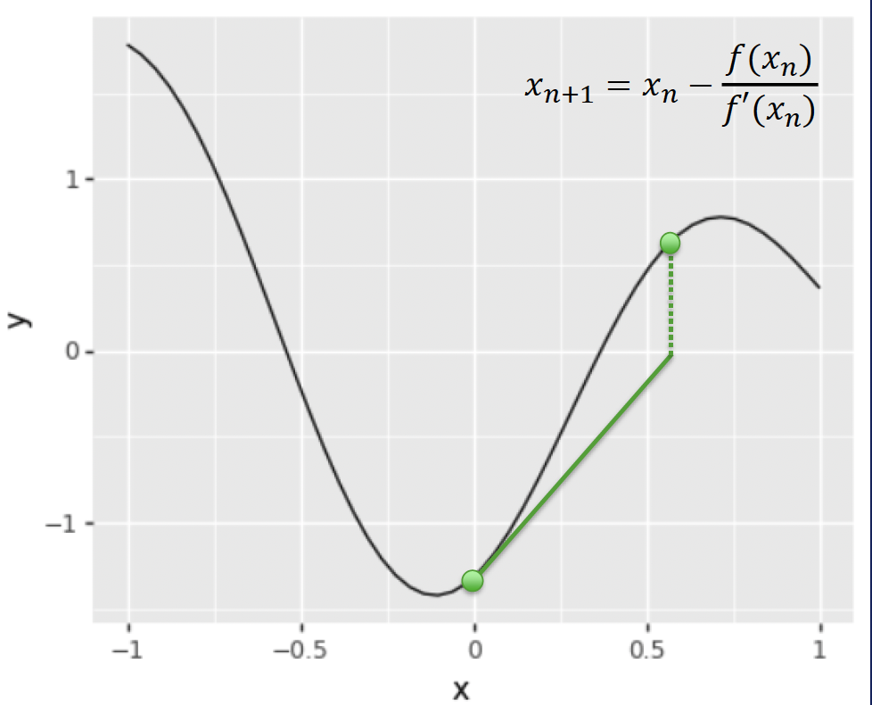

# Iterative Algorithms

## 0. Learning Objectives
- Apply the gradient descent algorithm to estimate minima/maxima.
- Apply Newton's method to estimate zeros.
- Explain k-means clustering.

## 1. Definitions
An **iterative algorithm**:
- Starts with an initial guess
- Produces approximate solutions based on previous ones
- Has a termination condition

**Direct methods**: Finite operations for exact solutions (assuming exact arithmetic).

## 2. Convergence
An algorithm converges if its approximate solutions approach a value $S$ within any error tolerance $\epsilon > 0$ after sufficient iterations.

### Example: Newton's Method
For finding roots of $f(x)$:
$x_{n+1} = x_n - \frac{f(x_n)}{f'(x_n)}$



```python
g = lambda x: (x ** 4 / 4 - 2 * x ** 3 / 3 - x ** 2 / 2 + 2 * x + 2)
f = lambda x: g(x - 2)
h = 1e-4
f_prime = lambda x: (f(x + h) - f(x)) / h
gamma = 0.01
guess = 7   # initial guess
for _ in range(10):
    print(guess)
    guess = guess - gamma * f_prime(guess)
```

### Example: Gradient Descent

#### Local vs Global Optima


- **Local Minimum**: $f(x) \leq f(y)$ for all $y$ near $x$
- **Global Minimum**: $f(x) \leq f(y)$ for all $y$ in domain of $f$

#### Algorithm
$x_{n+1} = x_n - \eta \nabla f(x_n)$
- $\eta$: learning rate
- $\nabla f(x_n)$: gradient at $x_n$


Converges to local minimum under certain conditions.

#### Avoiding Local Minima
- Multiple starting points
- Stochastic jumps
- Accepting occasional increases

### Stopping Criteria
- Maximum iterations
- Small changes in guesses
- Small changes in function value


## 4. K-means Clustering

K-means groups data into $k$ clusters, minimizing the Within Clusters Sum of Squares (WCSS):

$$\text{WCSS} = \sum_{i=1}^k \sum_{x \in S_i} \|x - \mu_i\|^2$$

### Lloyd's Algorithm
1. Pick $k$ random points as initial centers
2. Assign points to nearest center
3. Recompute centers
4. Repeat steps 2-3 until convergence


### Limitations
- May converge to local minimum
- Sensitive to outliers
- Creates only convex clusters

### Python implementation
```python
import pandas as pd
import plotnine as p9
import random
import numpy as np

k = 3
df = pd.read_csv('https://gist.githubusercontent.com/netj/8836201/raw/iris.csv')

def normalize(series):
    return (series - series.mean()) / series.std()

df['petal.length.normalized'] = normalize(df['petal.length'])
df['petal.width.normalized'] = normalize(df['petal.width'])

pts = [np.array(pt) for pt in zip(df['petal.length.normalized'], df['petal.width.normalized'])]
centers = random.sample(pts, k)
old_cluster_ids, cluster_ids = None, [] # arbitrary but different
while cluster_ids != old_cluster_ids:
    old_cluster_ids = list(cluster_ids)
    cluster_ids = []
    for pt in pts:
        min_cluster = -1
        min_dist = float('inf')
        for i, center in enumerate(centers):
            dist = np.linalg.norm(pt - center)
            if dist < min_dist:
                min_cluster = i
                min_dist = dist
        cluster_ids.append(min_cluster)
    df['cluster'] = cluster_ids
    cluster_pts = [[pt for pt, cluster in zip(pts, cluster_ids) if cluster == match] for match in range(k)]
    centers = [sum(pts)/len(pts) for pts in cluster_pts]

(p9.ggplot(df, p9.aes(x="petal.length.normalized", y="petal.width.normalized", color="cluster"))
+ p9.geom_point()).draw()
```

