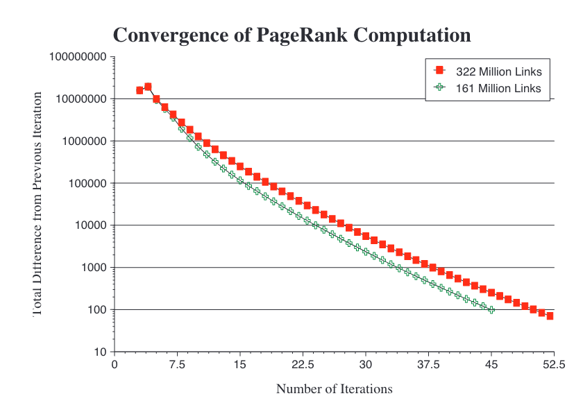

# The PageRank Citation Ranking: Bringing Order to the Web

[Paper Link](http://ilpubs.stanford.edu:8090/422/)

PageRank is a fundamental algorithm developed by Larry Page and Sergey Brin, designed to measure the importance of web pages within the vast graph structure of the World Wide Web. The algorithm uses the link structure of the web to determine the relative "importance" of individual pages, which can then be used to rank search engine results. Let's delve into the mathematical underpinnings of PageRank, its iterative computation, and its implications.

## Mathematical Foundation of PageRank

PageRank can be thought of as a way of computing the stationary distribution of a Markov chain defined on the web graph. Here's how it works mathematically:

1. **Web as a Directed Graph**:
   - Each web page is represented as a node in a directed graph.
   - Hyperlinks between pages are represented as directed edges. If page $ u $ links to page $ v $, there is a directed edge from $u$ to $ v $.

2. **Basic PageRank Formula**:
   The core idea is that a page is considered important if it is linked to by other important pages. Mathematically, the PageRank $ R(u) $ of a page $ u $ can be defined recursively as:

   $$ R(u) = \sum_{v \in B_u} \frac{R(v)}{N_v} $$

   where:
   - $ B_u $ is the set of pages that link to page $ u $ (backlinks).
   - $ N_v $ is the number of outgoing links from page $ v $.

   This formula suggests that the rank of page $ u $ is determined by the ranks of the pages linking to it, divided by their respective number of outgoing links.


3. **Matrix Representation**:
   - We can represent the web as a stochastic matrix $ A $, where each element $ A_{vu} $ is $ \frac{1}{N_v} $ if there is a link from page $ v $ to page $ u $, and 0 otherwise.
   - The PageRank vector $ R $ is then the principal eigenvector of this matrix:

   $$ R = A R $$

4. **Handling Rank Sinks**:
   A simple iterative computation of the formula above can lead to rank sinks — situations where pages without outgoing links (dangling nodes) absorb all the rank. To prevent this, a damping factor $ d $ is introduced. The modified PageRank formula becomes:

   $$ R(u) = \frac{1 - d}{N} + d \sum_{v \in B_u} \frac{R(v)}{N_v} $$

   where:
   - $ d $ is typically set to 0.85, representing the probability that a user continues following links rather than jumping to a random page.
   - $ N $ is the total number of pages.

5. **Random Surfer Model**:
   This damping factor can be understood through the "random surfer" model. A random surfer moves from page to page by following hyperlinks but occasionally jumps to a random page on the web. The damping factor $ d $ reflects the probability that the surfer follows a link, while $ 1 - d $ is the probability of a random jump.

6. **Iterative Computation**:
   PageRank is computed iteratively until convergence:
   - Start with an initial rank assignment, often uniform (e.g., $ R(u) = \frac{1}{N} $ for all $ u $).
   - Repeatedly apply the PageRank formula to update the ranks.
   - Continue iterations until the rank values converge within a predefined tolerance.

   Mathematically, this is equivalent to finding the principal eigenvector of the Google matrix $ G = dA + \dfrac{1-d}{N}E $, where $ E $ is a matrix with all elements set to 1.

## Python Implementation of PageRank

Below is a Python implementation of the PageRank algorithm using the iterative approach:

```python
import numpy as np

def pagerank(G, d=0.85, tol=1.0e-6, max_iter=100):
    """
    Computes PageRank for each node in the graph G.
    
    Parameters:
    G (numpy.ndarray): Adjacency matrix representing the graph.
    d (float): Damping factor, typically set to 0.85.
    tol (float): Convergence tolerance.
    max_iter (int): Maximum number of iterations.
    
    Returns:
    numpy.ndarray: Array of PageRank values for each node.
    """
    N = G.shape[0]
    R = np.ones(N) / N  # Initial uniform PageRank values
    M = G / G.sum(axis=0)  # Normalized adjacency matrix (stochastic matrix)

    for i in range(max_iter):
        R_new = (1 - d) / N + d * M @ R
        if np.linalg.norm(R_new - R, 1) < tol:
            print(f"Converged after {i+1} iterations.")
            break
        R = R_new

    return R

# Example usage
G = np.array([[0, 0, 1, 0],
              [1, 0, 0, 1],
              [0, 1, 0, 0],
              [1, 1, 0, 0]])

ranks = pagerank(G)
print("PageRank values:", ranks)
```

In this code:

- `G` is the adjacency matrix of the web graph.
- `d` is the damping factor.
- `R` is initialized with equal probability for each page.
- The iterative process continues until the PageRank values converge within a tolerance level or the maximum number of iterations is reached.



## Results and Implications

1. **Convergence and Computation**:
   - The PageRank algorithm converges to a unique steady-state distribution regardless of the initial rank distribution, provided the graph is sufficiently connected (a strongly connected component or a graph with some level of teleportation).
   - The convergence is typically rapid, often within 50-100 iterations for large graphs, making the method computationally efficient for web-scale graphs.

2. **Rank Interpretation**:
   - The final PageRank values provide a probability distribution over web pages, indicating the likelihood that a random surfer lands on any given page at any time.
   - Pages with higher PageRank values are considered more "important" and are ranked higher in search engine results.

3. **Applications Beyond Search**:
   - Beyond its application in search engines, PageRank can be used to analyze citation networks, social networks, and any system where a form of directed importance or influence needs to be quantified.
   - It is also used in applications such as web traffic estimation, backlink prediction, and personalized navigation systems.

## Conclusion

PageRank's mathematical elegance lies in its simplicity and power to leverage the web's link structure for ranking pages. By modeling the web as a Markov chain and using iterative methods to compute a stationary distribution, PageRank provides a robust measure of page importance that has fundamentally shaped the way information is retrieved on the internet. The success of PageRank demonstrates the effectiveness of utilizing graph theory and probability in real-world applications, particularly in the realm of large-scale information retrieval.