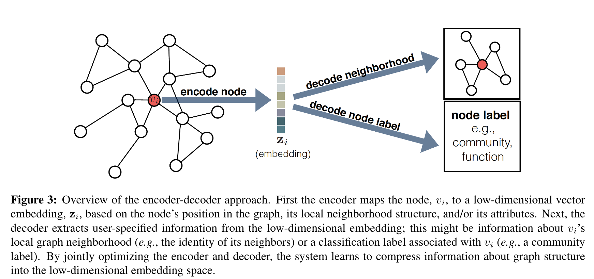
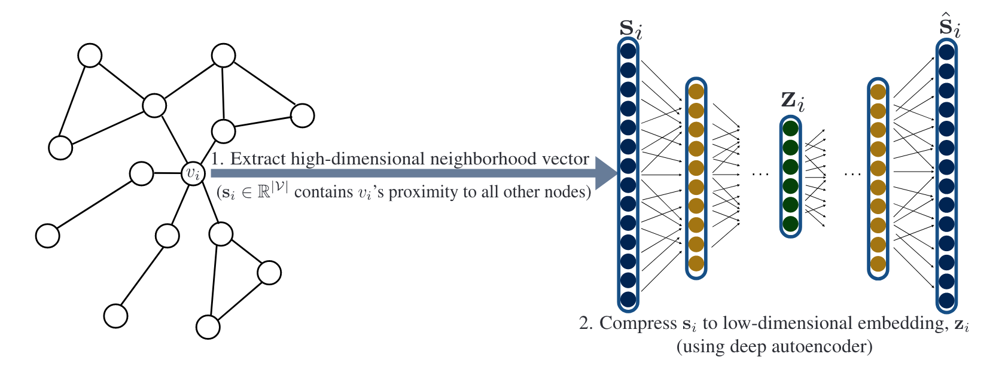
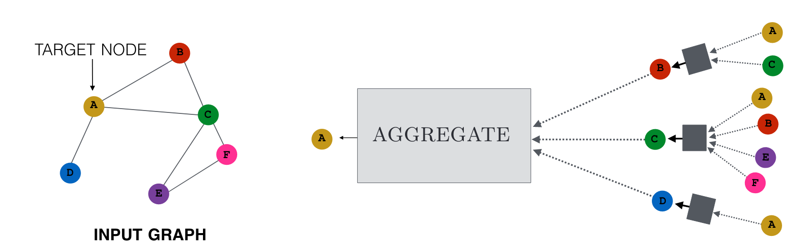
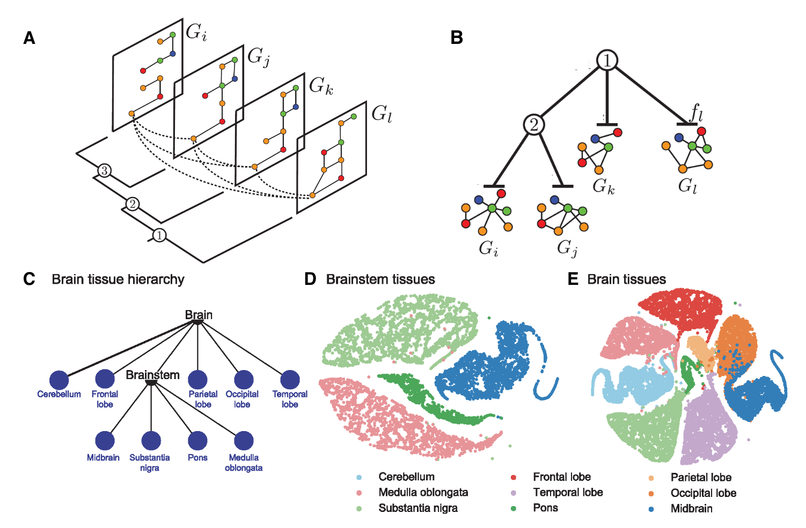

# Representation Learning on Graphs: Methods and Applications

[Paper Link](https://arxiv.org/abs/1709.05584)

## Introduction

Graphs are ubiquitous data structures that can represent a wide variety of complex systems, from social networks to molecular structures. In recent years, there has been a surge of interest in developing machine learning techniques for graph-structured data. This blog post will provide a deep dive into the key ideas and methods in representation learning on graphs, based on the comprehensive review paper by Hamilton, Ying, and Leskovec.


## 1. The Encoder-Decoder Framework

At the heart of most graph representation learning methods is the encoder-decoder framework. This approach aims to learn low-dimensional vector representations (embeddings) of nodes or subgraphs that capture important structural information.



### Key components:

1. **Encoder**: $\mathrm{ENC} : V \rightarrow \mathbb{R}^d$
   - Maps nodes to vector embeddings
2. **Decoder**: $\mathrm{DEC} : \mathbb{R}^d \times \mathbb{R}^d \rightarrow \mathbb{R}^+$
   - Reconstructs pairwise similarity from embeddings
3. **Similarity measure**: $s_\mathcal{G} : V \times V \rightarrow \mathbb{R}^+$
   - Defines similarity between nodes in the original graph
4. **Loss function**: $L = \sum_{(v_i,v_j)\in D} \ell(\mathrm{DEC}(z_i, z_j), s_\mathcal{G}(v_i, v_j))$
   - Measures discrepancy between decoded and true similarities

Where:
- $V$ is the set of nodes
- $z_i$ is the embedding of node $v_i$
- $D$ is the set of training node pairs

The goal is to learn an encoder that maps nodes to embeddings such that the decoder can accurately reconstruct the original graph similarities from these embeddings.

## 2. Shallow Embedding Methods

Shallow embedding methods learn embeddings directly, without using deep neural networks. These methods typically use a simple "embedding lookup" as the encoder:

$\mathrm{ENC}(v_i) = \mathbf{Z} \mathbf{v}_i$

Where $\mathbf{Z} \in \mathbb{R}^{d \times \vert V \vert}$ is a matrix containing the embedding vectors for all nodes, and $v_i \in \mathbb{I}^{\vert V \vert}$ is a one-hot indicator vector.

Here's a comparison of some popular shallow embedding approaches:

| Method | Decoder | Similarity Measure | Loss Function |
|--------|---------|-------------------|---------------|
| Laplacian Eigenmaps | $$ \|\mathbf{z}_i - \mathbf{z}_j\|^2_2 $$ | general | $$ \mathrm{DEC}(\mathbf{z}_{i}, \mathbf{z}_{j}) \cdot s_\mathcal{G}(v_i, v_j) $$ |
| Graph Factorization | $$ \mathbf{z}_i^\top \mathbf{z}_j $$ | $$ \mathbf{A}_{ij} $$ | $$ \|\mathrm{DEC}(\mathbf{z}_{i}, \mathbf{z}_{j}) - s_\mathcal{G}(v_i, v_j)\|^2_2 $$ |
| GraRep | $$ \mathbf{z}_i^\top \mathbf{z}_j $$ | $$ \mathbf{A}_{ij}, \mathbf{A}^2_{ij}, ..., \mathbf{A}^k_{ij} $$ | $$ \|\mathrm{DEC}(\mathbf{z}_i, \mathbf{z}_j) - s_\mathcal{G}(v_i, v_j)\|^2_2 $$ |
| HOPE | $$ \mathbf{z}_i^\top \mathbf{z}_j $$ | general | $$ \|\mathrm{DEC}(\mathbf{z}_i, \mathbf{z}_j) - s_\mathcal{G}(v_i, v_j)\|^2_2 $$ |
| DeepWalk | $$ \frac{\exp(\mathbf{z}_i^\top \mathbf{z}_j)}{\sum_k \exp(\mathbf{z}_i^\top \mathbf{z}_k)} $$ | $$ p_\mathcal{G}(v_j\|v_i) $$ | $$ -s_\mathcal{G}(v_i, v_j) \log(\mathrm{DEC}(\mathbf{z}_i, \mathbf{z}_j)) $$ |
| node2vec | $$ \frac{\exp(\mathbf{z}_i^\top \mathbf{z}_j)}{\sum_k \exp(\mathbf{z}_i^\top \mathbf{z}_k)} $$ | $$ p_\mathcal{G}(v_j\|v_i) $$ (biased) | $$ -s_\mathcal{G}(v_i, v_j) \log(\mathrm{DEC}(\mathbf{z}_i, \mathbf{z}_j)) $$ |

### 2.1 Laplacian Eigenmaps

Laplacian Eigenmaps (LE) is based on the idea of preserving local neighborhoods in the embedding space. The objective function is:

$$\min_Z \sum_{i,j} \mathbf{A}_{ij} \|\mathbf{z}_i - \mathbf{z}_j\|^2_2$$

where $\mathbf{A}_{ij}$ is the adjacency matrix. This can be rewritten as:

$$\min_Z \text{tr}(\mathbf{Z}^\top \mathbf{L} \mathbf{Z})$$

subject to $\mathbf{Z}^\top \mathbf{D} \mathbf{Z} = \mathbf{I}$, where $\mathbf{L} = \mathbf{D} - \mathbf{A}$ is the graph Laplacian, $\mathbf{D}$ is the degree matrix, and $\text{tr}(\cdot)$ is the trace operator.

The solution is given by the eigenvectors corresponding to the smallest non-zero eigenvalues of the generalized eigenproblem:

$$\mathbf{L} \mathbf{v} = \lambda \mathbf{D} \mathbf{v}$$

### 2.2 Graph Factorization

Graph Factorization (GF) aims to factorize the adjacency matrix $A$ directly:

$$\min_Z \sum_{(i,j) \in E} (\mathbf{A}_{ij} - \mathbf{z}_i^\top \mathbf{z}_j)^2 + \frac{\lambda}{2} \sum_i \|\mathbf{z}_i\|^2_2$$

The optimization is typically done using stochastic gradient descent:

$$\frac{\partial \mathcal{L}}{\partial \mathbf{z}_i} = \sum_{j:(i,j) \in E} (\mathbf{z}_i^\top \mathbf{z}_j - \mathbf{A}_{ij})\mathbf{z}_j + \lambda \mathbf{z}_i$$

### 2.3 GraRep

GraRep extends the idea of Graph Factorization to capture higher-order proximities. It factorizes a series of matrices $A^k$ for $k = 1, 2, ..., K$:

$$\min_{\mathbf{Z}^{(k)}} \|\mathbf{A}^k - \mathbf{Z}^{(k)}(\mathbf{Z}^{(k)})^\top\|^2_F$$

where $\|\cdot\|_F$ is the Frobenius norm. The final embedding is the concatenation of all $\mathbf{Z}^{(k)}$:

$$\mathbf{Z} = [\mathbf{Z}^{(1)} || \mathbf{Z}^{(2)} || ... || \mathbf{Z}^{(K)}]$$

### 2.4 HOPE

HOPE (High-Order Proximity preserved Embedding) aims to preserve asymmetric transitivity in directed graphs. It factorizes a general similarity matrix $\mathbf{S}$:

$$\min_{\mathbf{Z}} \|\mathbf{S} - \mathbf{Z}_s \mathbf{Z}_t^\top\|^2_F$$

where $\mathbf{Z}_s$ and $\mathbf{Z}_t$ are source and target embeddings. Different similarity measures can be used, such as Katz Index:

$$\mathbf{S} = (\mathbf{I} - \beta \mathbf{A})^{-1} - \mathbf{I}$$

### 2.5 DeepWalk

DeepWalk uses random walks to define node similarity. For each node $v_i$, it samples $N$ random walks of length $T$. The objective is to maximize:

$$\max_\mathbf{Z} \sum_{v_i \in V} \sum_{-w \leq j \leq w, j \neq 0} \log P(v_{i+j} | v_i)$$

where

$$P(v_j | v_i) = \frac{\exp(\mathbf{z}_j^\top \mathbf{z}_i)}{\sum_{k \in V} \exp(\mathbf{z}_k^\top \mathbf{z}_i)}$$

This is optimized using skip-gram with negative sampling.


### 2.6 node2vec

node2vec extends DeepWalk by introducing biased random walks controlled by parameters $p$ and $q$. The transition probability in a random walk is:

$$P(v_i = x | v_{i-1} = t) = \begin{cases} 
\frac{1}{p} & \text{if } d_{tx} = 0 \\
1 & \text{if } d_{tx} = 1 \\
\frac{1}{q} & \text{if } d_{tx} = 2
\end{cases}$$

where $d_{tx}$ is the shortest path distance between nodes $t$ and $x$.

### 2.7 Limitations of Shallow Embedding Methods

Before diving into generalized encoder-decoder architectures, it's important to understand the limitations of shallow embedding methods:

1. Lack of parameter sharing: Each node has its own unique embedding vector, leading to $\mathcal{O}(\vert \mathcal{V} \vert)$ parameters.
2. Inability to leverage node attributes: Many graphs have rich attribute information that shallow methods ignore.
3. Transductive nature: These methods can't generate embeddings for nodes unseen during training.

## 3. Generalized Encoder-Decoder Architectures

To address these limitations, researchers have developed more sophisticated encoder-decoder architectures. These approaches use neural networks to generate embeddings, allowing for parameter sharing and the incorporation of node attributes.



### 3.1 Neighborhood Auto-Encoder Methods

Two prominent examples in this category are DNGR (Deep Neural Graph Representations) and SDNE (Structural Deep Network Embeddings).

#### DNGR (Deep Neural Graph Representations)

1. Constructs a probabilistic co-occurrence matrix using random surfs.
2. Applies PPMI (Positive Pointwise Mutual Information) to the matrix.
3. Uses a stacked denoising autoencoder to learn node embeddings.

The objective function is:

$$\mathcal{L} = \sum_{v_i \in \mathcal{V}} \|\mathrm{DEC}(\mathrm{ENC}(s_i)) - s_i\|^2_2$$

where $s_i$ is the PPMI vector for node $v_i$.

#### SDNE (Structural Deep Network Embeddings)

SDNE uses a deep autoencoder to preserve both first-order and second-order proximities:

1. First-order proximity: 
$$\mathcal{L}_{1st} = \sum_{(i,j) \in \mathcal{E}} \mathbf{A}_{ij} \Vert \mathbf{z}_i - \mathbf{z}_j \Vert^2_2$$
2. Second-order proximity: 
$$\mathcal{L}_{2nd} = \sum_{i=1}^{\vert \mathcal{V} \vert} \Vert (\hat{s_i} - s_i) \odot b_i \Vert^2_2$$

where $\hat{s_i} = \mathrm{DEC}(\mathrm{ENC}(s_i))$, $s_i$ is the adjacency vector of node $v_i$, and $b_i$ is a weight vector.

The total loss is a combination of these two terms: $\mathcal{L} = \mathcal{L}_{2nd} + \alpha \mathcal{L}_{1st} + \lambda \mathcal{L}_{reg}$

### 3.2 Neighborhood Aggregation Methods

Another important class of generalized encoder-decoder architectures is neighborhood aggregation methods. These approaches generate embeddings by recursively aggregating information from a node's local neighborhood.

The general algorithm for these methods is:

```
1. Initialize node embeddings h^0_v = x_v (node attributes)
2. For k = 1 to K:
3.      For each node v:
4.           Aggregate neighbor embeddings: h^k_N(v) = AGGREGATE_k({h^(k-1)_u, ∀u ∈ N(v)})
5.           Update node embedding: h^k_v = UPDATE_k(h^(k-1)_v, h^k_N(v))
6.      Normalize embeddings (optional)
7. Final embedding: z_v = h^K_v
```



#### Graph Convolutional Networks (GCNs)

GCNs use the following layer-wise propagation rule:

$$\mathbf{H}^{(l+1)} = \sigma(\tilde{\mathbf{D}}^{-\frac{1}{2}}\tilde{\mathbf{A}}\tilde{\mathbf{D}}^{-\frac{1}{2}}\mathbf{H}^{(l)}\mathbf{W}^{(l)})$$

where $$ \tilde{\mathbf{A}} = \mathbf{A} + \mathbf{I}_N $$ is the adjacency matrix with self-connections, $$\tilde{\mathbf{D}}_{ii} = \sum_{j} \tilde{\mathbf{A}}_{ij},$$ and $\mathbf{W}^{(l)}$ is a layer-specific trainable weight matrix.

For node classification, the loss function is typically cross-entropy:

$$\mathcal{L} = -\sum_{i \in \mathcal{Y}_L} \sum_{f=1}^F \mathbf{Y}_{if} \ln \mathbf{Z}_{if}$$

where $\mathcal{Y}_L$ is the set of labeled nodes, $F$ is the number of classes, $\mathbf{Y}_{if}$ is the ground truth, and $\mathbf{Z}_{if}$ is the predicted probability.

#### GraphSAGE

GraphSAGE uses the following update rule:

$$\mathbf{h}_v^k = \sigma(\mathbf{W}^k \cdot \text{CONCAT}(\mathbf{h}_v^{k-1}, \text{AGG}_k(\{\mathbf{h}_u^{k-1}, \forall u \in \mathcal{N}(v)\})))$$

Different aggregator functions can be used:

1. Mean aggregator:
   $$\text{AGG}_\text{mean} = \frac{1}{|\mathcal{N}(v)|} \sum_{u \in \mathcal{N}(v)} \mathbf{h}_u^{k-1}$$

2. Max-pooling aggregator:
   $$\text{AGG}_\text{max} = \max(\{\sigma(\mathbf{W}_\text{pool} \mathbf{h}_u^{k-1} + \mathbf{b}), \forall u \in \mathcal{N}(v)\})$$

3. LSTM aggregator:
   $$\text{AGG}_\text{LSTM} = \text{LSTM}(\{\mathbf{h}_u^{k-1}, \forall u \in \pi(\mathcal{N}(v))\})$$
   where $\pi$ is a random permutation.

The final embeddings are normalized:

$$\mathbf{z}_v = \frac{\mathbf{h}_v^K}{\|\mathbf{h}_v^K\|_2}$$


## 4 Incorporating Task-Specific Supervision

Many node embedding algorithms can incorporate task-specific supervision, especially for node classification tasks. This is typically done by adding a supervised loss term to the unsupervised loss.

For binary classification, the supervised loss might be:

$$\mathcal{L}_{sup} = \sum_{v_i \in V} y_i \log(\sigma(\mathbf{z}_i^\top \theta)) + (1 - y_i) \log(1 - \sigma(\mathbf{z}_i^\top \theta))$$

where $y_i$ is the true label, $\mathbf{z}_i$ is the node embedding, and $\theta$ is a learnable parameter vector.

The total loss becomes a combination of unsupervised and supervised losses:

$$\mathcal{L} = \mathcal{L}_{unsup} + \lambda \mathcal{L}_{sup}$$

where $\lambda$ is a hyperparameter balancing the two objectives.

## 5 Extensions to Multi-Modal Graphs

Many real-world graphs have complex structures with multiple node and edge types. Several approaches have been developed to handle these multi-modal graphs.



### 5.1 Dealing with Different Node and Edge Types

1. Use different encoders for different node types.
2. Extend pairwise decoders with type-specific parameters.

For graphs with different edge types, a common approach is to use a bilinear decoder:

$$\mathrm{DEC}_\tau(\mathbf{z}_i, \mathbf{z}_j) = \mathbf{z}_i^\top A_\tau \mathbf{z}_j$$

where $\tau$ indexes the edge type and $A_\tau$ is a learned parameter specific to that edge type.

### 5.2 Heterogeneous Skip-gram

For heterogeneous graphs, the DeepWalk idea can be extended by defining type-specific random walks. The objective becomes:

$$\max_\mathbf{Z} \sum_{v_i \in V} \sum_{\tau \in T} \sum_{-w \leq j \leq w, j \neq 0} \log P(v_{i+j}^\tau \mid v_i)$$

where $T$ is the set of node types and $v_{i+j}^\tau$ is a node of type $\tau$ at position $i+j$ in the random walk.

### 5.3 Metapath2vec

This method defines random walks based on metapaths, which are sequences of node types. For example, in a scholar network, a metapath might be Author-Paper-Author.

The skip-gram objective is then applied to these metapath-based random walks.

### 5.4 Multi-layer Graph Embeddings

For graphs with multiple layers (e.g., protein-protein interactions in different tissues), methods like OhmNet have been proposed. OhmNet uses a regularization term to tie embeddings of the same node across different layers:

$$L_{reg} = \lambda \sum_{v_i \in V} \sum_{l,m \in L} \Vert z_i^l - z_i^m \Vert^2$$

where $L$ is the set of layers and $z_i^l$ is the embedding of node $i$ in layer $l$.


## 6. Graph Neural Networks (GNNs)

### 6.1 Basic GNN

The original GNN framework uses the following update rule:

$$h_v = f(x_v, x_{co[v]}, h_{ne[v]}, x_{ne[v]})$$

where $x_v$ is the feature vector of node $v$, $x_{co[v]}$ are the features of the edges incident to $v$, $h_{ne[v]}$ are the hidden states of the neighbors, and $x_{ne[v]}$ are the features of the neighbors.

The function $f$ is typically implemented as a neural network and is constrained to be a contraction mapping to ensure convergence.

### 6.2 Gated Graph Neural Networks

Gated GNNs use GRU units for the update function:

$$h_v^{(t)} = \text{GRU}(h_v^{(t-1)}, \sum_{u \in \mathcal{N}(v)} W h_u^{(t-1)})$$

The GRU update equations are:

$$\begin{aligned}
z_v^{(t)} &= \sigma(W_z x_v^{(t)} + U_z h_v^{(t-1)} + b_z) \\
r_v^{(t)} &= \sigma(W_r x_v^{(t)} + U_r h_v^{(t-1)} + b_r) \\
\tilde{h}_v^{(t)} &= \tanh(W_h x_v^{(t)} + U_h(r_v^{(t)} \odot h_v^{(t-1)}) + b_h) \\
h_v^{(t)} &= (1 - z_v^{(t)}) \odot h_v^{(t-1)} + z_v^{(t)} \odot \tilde{h}_v^{(t)}
\end{aligned}$$

where $x_v^{(t)} = \sum_{u \in \mathcal{N}(v)} W h_u^{(t-1)}$.

### 6.3 Message Passing Neural Networks (MPNNs)

MPNNs provide a general framework for GNNs:

$$\begin{aligned}
m_v^{(t+1)} &= \sum_{w \in \mathcal{N}(v)} \mathcal{M}_t(h_v^t, h_w^t, e_{vw}) \\
h_v^{(t+1)} &= \mathcal{U}_t(h_v^t, m_v^{(t+1)})
\end{aligned}$$

where $$\mathcal{M}_t$$ is the message function, $$\mathcal{U}_t$$ is the update function, and $$e_{vw}$$ are edge features.

For graph-level outputs, a readout function is used:

$$\hat{y} = \mathcal{R}(\{h_v^{(T)} | v \in \mathcal{G}\})$$

Different choices of $\mathcal{M}_t$, $\mathcal{U}_t$, and $\mathcal{R}$ lead to different GNN architectures.

## 7. Subgraph Embedding Methods

### 7.1 Sum-based Approach

The simplest approach is to sum the embeddings of all nodes in the subgraph:

$$\mathbf{z}_\mathcal{S} = \sum_{v \in \mathcal{S}} \mathbf{z}_v$$

This can be extended to a weighted sum:

$$\mathbf{z}_\mathcal{S} = \sum_{v \in \mathcal{S}} w_v \mathbf{z}_v$$

where $w_v$ could be based on node centrality measures.

### 7.2 Graph Coarsening

Graph coarsening involves creating a hierarchy of graphs $$\mathcal{G}_0, \mathcal{G}_1, ..., \mathcal{G}_L$$ where each $$\mathcal{G}_l$$ is a coarsened version of $$\mathcal{G}_{l-1}$$. One approach is to use multilevel partitioning:

1. Matching: Find a maximal independent edge set $$\mathcal{M}_l$$ in $$\mathcal{G}_l$$.
2. Contraction: Create $\mathcal{G}_{l+1}$ by contracting the edges in $\mathcal{M}_l$.
3. Embedding: Compute embeddings for $\mathcal{G}_L$ using any node embedding method.
4. Refinement: Propagate embeddings from $\mathcal{G}_{l+1}$ to $\mathcal{G}_l$ and refine using local information.

### 7.3 Graph Pooling

Various pooling operations can be used to create fixed-size representations of subgraphs:

1. DiffPool:

   $$\begin{aligned}
   \mathbf{S}^{(l)} &= \text{softmax}(\text{GNN}_l^{pool}(\mathbf{A}^{(l)}, \mathbf{X}^{(l)})) \\
   \mathbf{X}^{(l+1)} &= \mathbf{S}^{(l)\top} \text{GNN}_l^{embed}(\mathbf{A}^{(l)}, \mathbf{X}^{(l)}) \\
   \mathbf{A}^{(l+1)} &= \mathbf{S}^{(l)\top} \mathbf{A}^{(l)} \mathbf{S}^{(l)}
   \end{aligned}$$

2. SortPool:
   Sort node features and select the top-k nodes:

   $$Z = \text{sort}(\text{CONCAT}(z_v | v \in G))[:k, :]$$

3. Set2Set:
   Use attention mechanism to create permutation-invariant graph representations:

   $$\begin{aligned}
   q_t &= \text{LSTM}(q_{t-1}) \\
   \alpha_{i,t} &= \text{softmax}(q_t^\top h_i) \\
   r_t &= \sum_i \alpha_{i,t} h_i \\
   q_{t+1} &= \text{LSTM}(q_t, r_t)
   \end{aligned}$$

These methods provide a range of approaches for learning representations of entire graphs or subgraphs, allowing for tasks such as graph classification and regression.

## 8. Applications

Graph representation learning has numerous applications, including:

1. **Node classification**: Predicting the labels of nodes in a graph (e.g., categorizing users in a social network)
2. **Link prediction**: Predicting the existence of edges between nodes (e.g., recommending friends in a social network)
3. **Graph classification**: Classifying entire graphs (e.g., predicting properties of molecules)
4. **Visualization**: Creating meaningful 2D or 3D visualizations of graph data
5. **Recommender systems**: Generating personalized recommendations based on user-item interaction graphs
6. **Drug discovery**: Predicting properties of molecular graphs for pharmaceutical applications

## 9. Challenges and Future Directions

While significant progress has been made in graph representation learning, several challenges and open problems remain:

1. **Scalability**: Developing methods that can handle truly massive graphs with billions of nodes and edges
2. **Dynamic graphs**: Incorporating temporal information and handling evolving graph structures
3. **Heterogeneous graphs**: Improving methods for graphs with multiple node and edge types
4. **Interpretability**: Enhancing the interpretability of learned representations
5. **Higher-order structures**: Capturing and leveraging complex structural patterns beyond pairwise relationships
6. **Theoretical foundations**: Developing a more rigorous theoretical understanding of graph representation learning

## 10. Conclusion

Representation learning on graphs is a rapidly evolving field with many exciting developments. By leveraging these advanced techniques, researchers and practitioners can unlock valuable insights from complex graph-structured data across a wide range of domains. As the field continues to progress, we can expect to see even more powerful and flexible methods for learning from graph-structured data, opening up new possibilities in areas such as social network analysis, bioinformatics, and artificial intelligence.