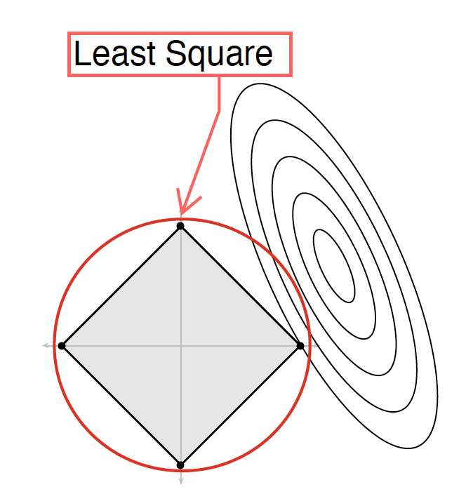

# Sparse Regression

## 1. Regression

We observe pair $(X_i, Y_i), i = 1, \ldots, n$ where $X_i \in \mathbb{R}^p$ is a feature vector and $Y_i \in \mathbb{R}$ is a scalar response.

$\mathcal{D} = \{(X_i, Y_i), i = 1, \ldots, n\}$ is the training data.

We assume the following model:

$$
Y_i = \beta_1 X_{i1} + \beta_2 X_{i2} + \cdots + \beta_p X_{ip} + \epsilon_i
$$

> Given a pair $(X_i, Y_i)$, we want to predict $Y_i$ using $X_i$.

Let $\hat{Y}_i$ be our prediction for $Y_i$. The *prediction error* or *risk* is

$$
R = E(Y - \hat{Y})^2
$$
where E is the expected value (mean).

The best predictor is the regression function

$$
m(x) = E(Y \mid X = x) = \int y f(y \mid x) dy
$$

where $f(y \mid x)$ is the conditional distribution of $Y$ given $X = x$. However, the true regression function is unknown, so we need to estimate it.

### 1.1. Prediction Risk

Given the training data $\mathcal{D} = \{(X_i, Y_i), i = 1, \ldots, n\}$, we want to find the best predictor $\hat{m}$ that minimizes the prediction risk $R(\hat{m})$.

$\text{Risk} = R(\hat{m}) = E(Y - \hat{m}(X))^2$

> Bias-Variance Decomposition:
>
> $$
> R(\hat{m}) = \int \text{Bias}^2(\hat{m}(x)) dx + \int \text{Var}(\hat{m}(x)) dx + \sigma^2
> $$
> where
> - $\sigma^2$ is the variance of the noise
> - $\text{Bias}^2(\hat{m}(x))$ is the squared bias of the predictor
> - $\text{Var}(\hat{m}(x))$ is the variance of the predictor.

Prediction $\text{Risk} = \text{Bias}^2 + \text{Variance} + \sigma^2$

Prediction methods with low bias tend to have high variance, and vice versa:
- Methods with low bias often have high variance.
- Methods with low variance often have high bias.

For example, the predictor $\hat{m}(x) = 0$ has zero variance but will be heavily biased for most problems.

To predict well, we need to balance the bias and the variance. This is known as the bias-variance tradeoff.

The optimal balance depends on the specific problem and the amount of available data.

## 1.2. Least Squares Estimation

To estimate the regression function, we use the method of least squares. We minimize the sum of squared residuals:

$$
\min_{\beta} \sum_{i=1}^n (Y_i - \beta^T X_i)^2
$$

The solution to this optimization problem is the least squares estimator:

$$
\hat{\beta} = (X^T X)^{-1} X^T Y
$$

where $X$ is the $n \times p$ design matrix and $Y$ is the $n \times 1$ response vector.

## 2. High dimensional problems

When $p$ is large, the matrix $X^T X$ can become singular or nearly singular, leading to unstable estimates with large variance.

### 2.1. Ridge Regression

Ridge regression addresses the instability of least squares when $p$ is large relative to $n$ or when there's multicollinearity. It adds a penalty term:

$$
\min_{\beta} \sum_{i=1}^n (Y_i - \beta^T X_i)^2 + \lambda \sum_{j=1}^p \beta_j^2
$$

where $\lambda > 0$ is a tuning parameter. The solution is:

$$
\hat{\beta}_{ridge} = (X^T X + \lambda I)^{-1} X^T Y
$$

### 2.2. Lasso Regression

#### 2.2.1 The Bias-Variance Tradeoff
This is a Goldilocks problem. Not too big, not too small, just right.

> **If there are $p$ variables, we have $2^p$ models.**

Suppose we have 30,000 genes, it seems we have to search through $2^{30000}$ models.

Two key ideas to make this feasible are sparsity and convex relaxation.

#### 2.2.2. Sparsity

Sparsity is the property of having many coefficients equal to zero.
Sparsity

Consider estimating $\beta = (\beta_1, \ldots, \beta_p)$ by minimizing:

$$
\sum_{i=1}^n \left(Y_i - (\beta_0 + \beta_1X_{i1} + \cdots + \beta_pX_{ip})\right)^2
$$

subject to the constraint on the "size" of $\beta$: $\|\beta\|_q \leq \text{small}$.

*Can we do this minimization?*

If we use $q = 0$, this is equivalent to searching through all $2^p$ models,
because $\|\beta\|_q^q$ is the number of nonzero coefficients as $q \to 0$.

*What about other values of $q$?*

#### 2.2.3. Convex Relaxation

Convex relaxation is a technique to relax the problem of finding the best subset of variables to a continuous problem.

#### 2.2.4. Sparsity Meets Convexity

We need these sets to have a nice shape (convex). If so, the
minimization is no longer computationally hard. In fact, it is easy.

Sensitivity to sparsity: $q < 1$
Convexity: $q > 1$

This means we should use $q = 1$.

> Lasso Regression:
>
> $$
> \min_{\beta} \sum_{i=1}^n (Y_i - \beta^T X_i)^2 + \lambda \sum_{j=1}^p |\beta_j|
> $$

### 2.3. Elastic Net

Elastic Net is a regularization method that combines the L1 and L2 penalties of Lasso and Ridge regression. It is defined as:

$$
\min_{\beta} \sum_{i=1}^n (Y_i - \beta^T X_i)^2 + \lambda \left( \alpha \|\beta\|_1 + (1-\alpha) \|\beta\|_2^2 \right)
$$

