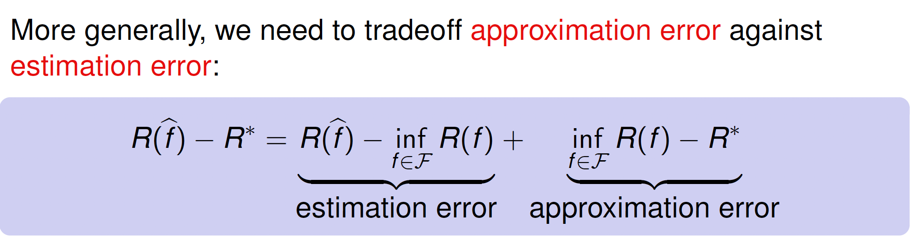
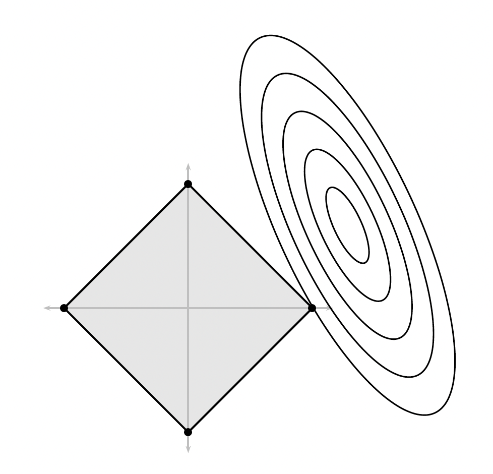
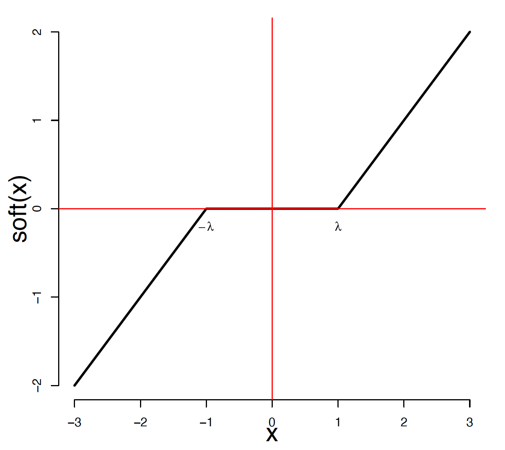
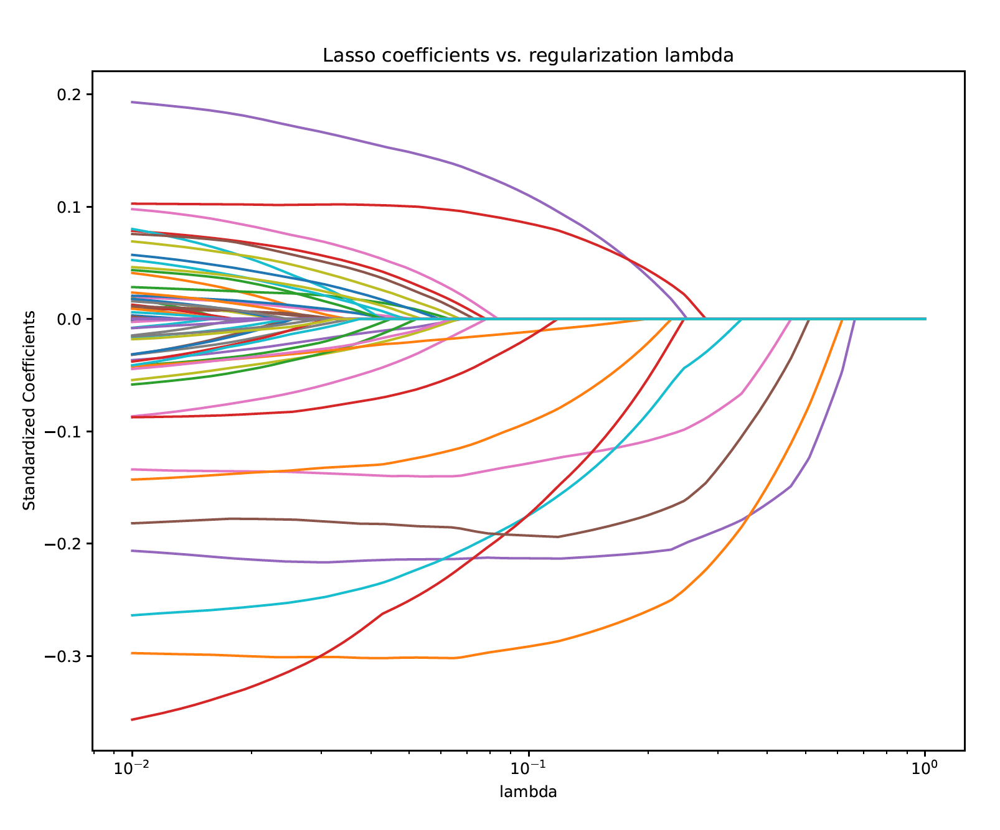
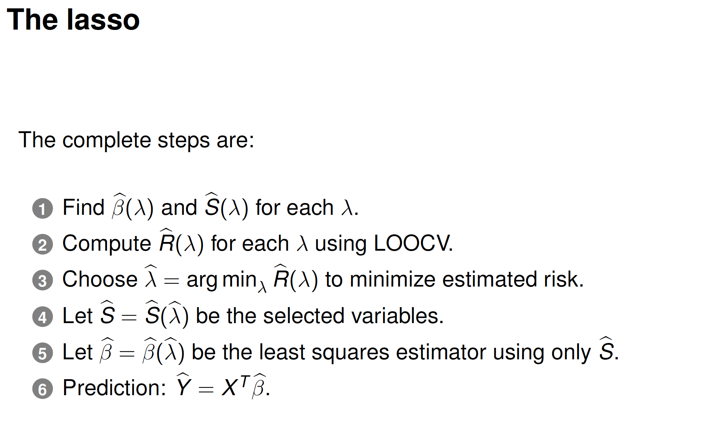

# Lasso Regression and Smoothing Methods

Lasso and smoothing are both techniques to handle regression problems, particularly when the number of predictors is large or when the relationship between the predictors and the response is not strictly linear.

## 1. Lasso Regression

Lasso (Least Absolute Shrinkage and Selection Operator) performs both variable selection and regularization to enhance the prediction accuracy and interpretability of the model.

The objective function for lasso is:

$$
\min_{\beta} \sum_{i=1}^n (Y_i - \beta^T X_i)^2 + \lambda \sum_{j=1}^p |\beta_j|
$$

- **L1 Regularization:** The $$ \sum_{j=1}^p \vert \beta_j \vert $$ term imposes sparsity by shrinking some coefficients exactly to zero.
- **Bias-Variance Tradeoff:** As $$ \lambda $$ increases, bias increases but variance decreases.

### 1.1 Algorithm for Lasso: Coordinate Descent

For each predictor $$ \beta_j $$, the algorithm minimizes the following expression using *soft-thresholding*:

$$
\hat{\beta_j} = \text{Soft}_{\lambda}(z_j) = \text{sign}(z_j)(|z_j| - \lambda)_+
$$

where $$z_j$$ is the residual from the current fit and $$\lambda$$ is the regularization parameter.

### 1.2 Lasso Algorithm

## 2. Smoothing Methods

Smoothing methods estimate relationships between predictors and responses when the form of the relationship is unknown, relying on *local averaging*.

### 2.1 Kernel Smoothing
A common smoothing method is *kernel smoothing*, which estimates $$ m(x) $$, the regression function, by averaging nearby values of the response:

$$
\hat{m}_h(x) = \frac{\sum_{i=1}^n Y_i K_h(X_i, x)}{\sum_{i=1}^n K_h(X_i, x)}
$$

- **Kernel Function** $$ K_h(X_i, x) $$: Measures the proximity of $$ X_i $$ to $$ x $$ (e.g., Gaussian kernel).
- **Bandwidth** $$ h $$: Controls how much smoothing occurs. Small $$ h $$ leads to low bias and high variance, while large $$ h $$ results in high bias and low variance.

### 2.2 Bias-Variance Tradeoff in Smoothing

For kernel smoothing, the risk decomposes as:

$$
\text{Risk}(h) = \text{Bias}^2(h) + \text{Variance}(h) + \sigma^2
$$

- $$ \text{Bias}^2 \propto h^4 $$
- $$ \text{Variance} \propto \frac{1}{nh} $$

The goal is to select $$ h $$ that balances bias and variance optimally.

## Conclusion

- **Lasso** introduces sparsity in high-dimensional settings, solving bias-variance tradeoffs by shrinking coefficients.
- **Smoothing methods** provide flexible, non-parametric techniques to estimate relationships without assuming a specific form but suffer from the curse of dimensionality in higher dimensions.

Both methods focus on addressing bias and variance in regression models.