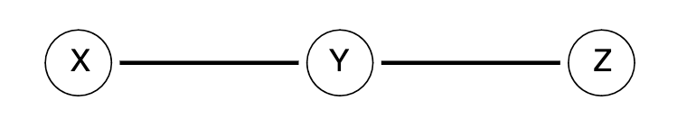
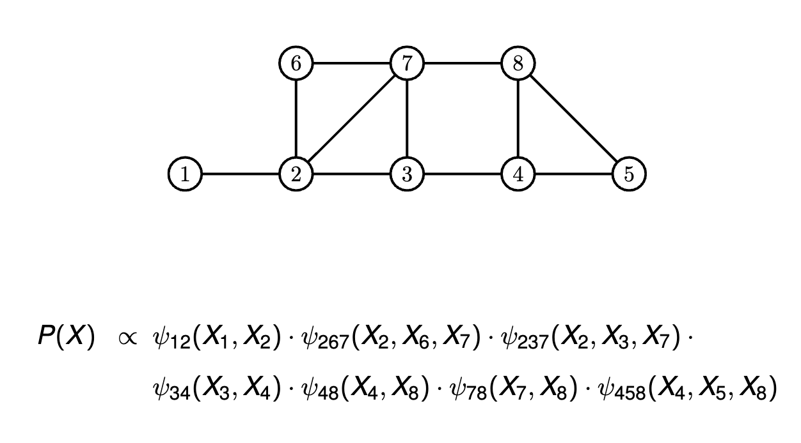
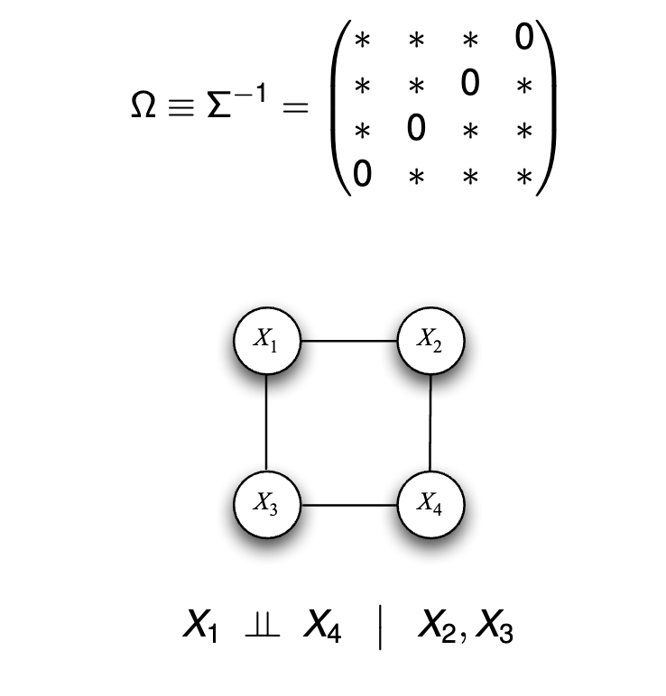
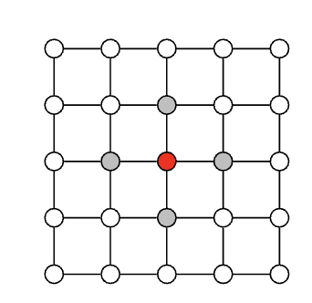

# Discrete Data Graphs and Graph Neural Networks

## 1. Markov Property

This encodes the independence relation

$$
X \perp Z \mid Y
$$

which means that X and Z are independent conditioned on Y.

A probability distribution $P$ satisfies the *global Markov property* with respect to a graph $G$ if:

for any disjoint vertex subsets $A$, $B$, and $C$ such that $C$ separates $A$ and $B$,

$$
X_A \perp X_B \mid X_C
$$

- $X_A$ are the random variables $X_j$ with $j \in A$.
- $C$ separates $A$ and $B$ means that there is no path from $A$ to $B$ that does not pass through $C$.

> The blue node is independent of the red nodes, given the white nodes.
>

## 2. Graph Estimation

### 2.1 Definition
- A graph $G$ represents the class of distributions, $\mathcal{P}(G)$, the distributions that are Markov with respect to $G$.

- Graph estimation: Given $n$ samples $X_1, \ldots, X_n \sim P$, estimate the graph $G$.

**Theorem 2.1 (Hammersley, Clifford, Besag)** A positive distribution over random variables $X_1, \ldots, X_p$ satisfies the Markov properties of graph $G$ if and only if it can be represented as

$$
p(X) \propto \prod_{c \in \mathcal{C}} \psi_c(X_c)
$$

where $\mathcal{C}$ is the set of cliques in the graph $G$.

> 

### 2.2 Gaussian Case

Let $\Omega = \Sigma^{-1}$ be the precision matrix. A zero in $\Omega$ indicates a lack of the corresponding edge in the graph So, the adjacency matrix of the graph is

$$
A = (\mathbb{1}(\Omega_{ij} \neq 0))
$$

That is,

$$
A_{ij} =
\begin{cases}
1 & \text{if } \vert \Omega_{ij} \vert > 0 \\
0 & \text{otherwise}
\end{cases}
$$

> 

### 2.3 Discrete Graphical Models

Positive distributions can be represented by an exponential family,

$$
p(X) \propto \exp
\left(
\sum_{c \in \mathcal{C}} \phi_c(X_c)
\right)
$$

where $\phi_c = \log \psi_c$ from *Hammersley-Clifford*.

*Special case:* Ising Model (discrete Gaussian)

We have a graph with edges $E$ and vertices $V$. Each node $i$ has a
random variable $X_i$ that can be “up” ($X_i = 1$) or “down” ($X_i = 0$)

$$
p_\beta(x_1, \ldots, x_n) \propto \exp
\left(
\sum_{s \in V} \beta_s x_s + \sum_{(s,t) \in E} \beta_{st} x_s x_t
\right)
$$

$E$ are the set of edges, $V$ are the vertices.

## 3. Algorithms

### 3.1 Graphical Lasso

Suppose we have $n$ observations $x_1, \ldots, x_n$ where $x_i \in \mathbb{R}^d$. The maximum likelihood estimate of $\mu$ and $\Omega$ are obtained in terms of the sample mean and sample covariance:

$$
\hat{\mu}_n = \frac{1}{n} \sum_{i=1}^n x_i,
$$

$$
\hat{\Sigma}_n = S_n^{-1} \text{ where } S_n = \frac{1}{n} \sum_{i=1}^n (x_i - \hat{\mu}_n)(x_i - \hat{\mu}_n)^T.
$$

In the following, we will simply assume that the mean $\mu$ is known. For $d < n$, the maximum likelihood estimate is easily obtained by noting that the log-likelihood of the data is

$$
\ell(\Omega) = \frac{n}{2} \log \vert \Omega \vert - \frac{n}{2} \text{tr}(\Omega S_n) - \frac{nd}{2} \log(2\pi)
$$

and the gradient of $\log \vert \chi \vert$ as a function of $\chi \in S_{++}^d$ is $\nabla \log \vert \chi \vert = \chi^{-1}$.

The glasso optimizes the parameters of $\Omega = \Sigma^{-1}$ by minimizing:

$$
\text{trace}(\Omega S_n) - \log \vert \Omega \vert + \lambda \sum_{j \neq k} \vert \Omega_{jk} \vert
$$

### 3.2 Parallel Lasso
> 
>
> Conditioned on $(x_2, \ldots, x_p)$, variable $X_1 \in \{0, 1\}$ has probability mass function given by a logistic function,
>
> $$
> p(X_1 = 1 \mid x_2, \ldots, x_p) = \text{sigmoid}
> \left(
> \beta_1 + \sum_{j \in N(1)} \beta_{1j} x_j
> \right)
> $$

**Strategy**
- Perform $l1$ regularized logistic regression of each node $X_i$ on $X_i = {X_j, j \neq i}$ to estimate neighbors $N(i)$
- Two versions:
    - Create an edge $(i,j)$ if $j \in N(i)$ and $i \in N(j)$
    - Create an edge $(i,j)$ if $j \in N(i)$ or $i \in N(j)$

## 4. Graph Neural Networks

### 4.1 Graph Laplacian

**Polynomials of the Laplacian**

$$
p_w(L) = w_0 I_n + w_1 L + w_2 L^2 + \cdots w_d L^d
$$

- If $\text{dist}(u,v) > i$ then the $(u,v)$ entry of $L^i$ is zero
- This is analogous to a CNN filter (kernel)
- The weights $w_i$ play role of filter coefficients
- Degree $d$ of polynomial plays a role of the size of the kernel

**The Laplacian is a Mercer kernel**

- Symmetric $L_{uv} = L_{vu}$
- Positive-definite:

$$
\begin{align*}
f^T L f &= \text{trace}(L f f^T) \\
&= \sum_{i=1}^n \sum_{j=1}^n L_{ij} f_i f_j \\
&= \sum_{i=1}^n \sum_{j=1}^n (D_{ij} - A_{ij}) f_i f_j\\
&= \sum_{i=1}^n D_{ii} f_i^2 - \sum_{i=1}^n \sum_{j=1}^n A_{ij} f_i f_j\\
&= \sum_{(u,v) \in E} (f(u) - f(v))^2
\end{align*}
$$

### 4.2 Equivariance

If we compute a feature map $f$, we’d like it to not depend on a
reordering $P$ of the nodes.

The reordering

$$
1 \leftarrow 2 \\
2 \leftarrow 3 \\
3 \leftarrow 1
$$

corresponds to permutation matrix

$$
P =
\begin{pmatrix}
0 & 1 & 0 \\
0 & 0 & 1 \\
1 & 0 & 0
\end{pmatrix}
$$

A transformation $f : \mathbb{R}^n \to \mathbb{R}^n$ is equivariant if

$$
f(Px) = Pf(x)
$$

for any permuation matrix $P$, where $PP^T = I$.

The transformed data and Laplacian are

$$
\begin{align*}
x &\to Px \\
L &\to PLP^T \\
L^i &\to PL^iP^T
\end{align*}
$$

The transformed polynomial kernels are

$$
\begin{align*}
f(Px) &= \sum_{i=0}^d w_i (PL^iP^T)Px \\
&= \sum_{i=0}^d w_iPL^ix \\
&= P\sum_{i=0}^d w_iL^ix \\
&= Pf(x)
\end{align*}
$$